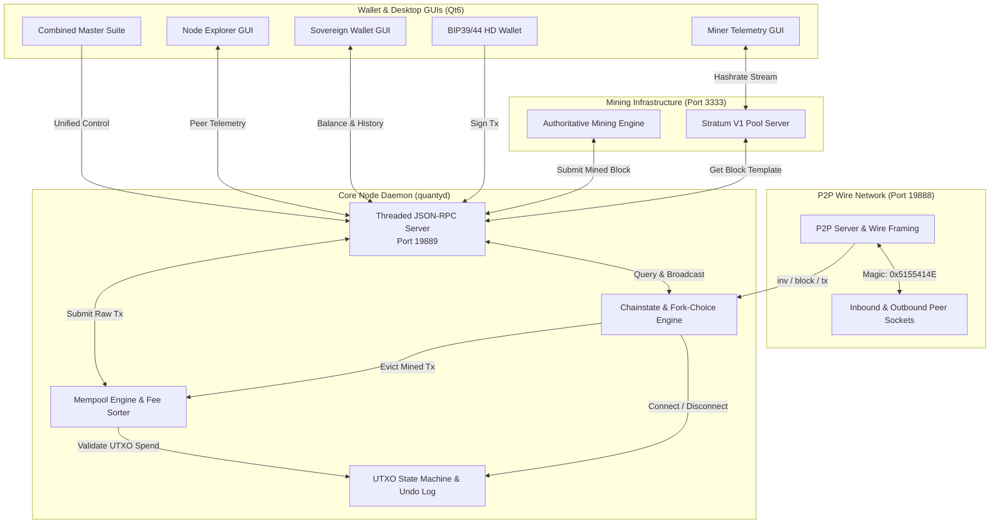

# QuantyCoin Technical Architecture Specification

**Protocol Version**: QTY2 (`70020`)  
**Network Identity**: QuantyCoin 2.0  
**Design Reference**: Independent PoW Layer-1 Protocol Architecture  

---

## 1. Architectural Overview

QuantyCoin is an independent Layer-1 cryptocurrency built on double-SHA256 (SHA-256D) Proof-of-Work. It provides high transaction density with a 32 MB block capacity, responsive single-block LWMA-1 difficulty retargeting, a native Stratum V1 mining pool server, BIP39/44 HD wallets with Bech32 witness encoding, and a multi-threaded JSON-RPC interface.

---

## 2. Core Protocol Parameters (Protocol Freeze)

| Parameter | Value | Consensus Rule |
| :--- | :--- | :--- |
| **Protocol Version** | `70020` | Version handshake identifier (`PROTOCOL_VERSION`) |
| **Chain Identifier** | `quantycoin-2.0` | Independent chain identity (`CHAIN_ID`) |
| **Network Magic (Mainnet)** | `0x5155414E` (`QUAN`) | 4-byte framing prefix on wire messages |
| **Default Ports** | P2P: `19888`, RPC: `19889`, Stratum: `3333` | Dedicated ports; zero conflict with Bitcoin or legacy networks |
| **Genesis Hash** | `00000f7cecd0b1eafaab4d65183f7bd12713b67b6c1c4a30f6bf3f1b8efd30ba` | Authoritative root of consensus |
| **Genesis Merkle Root** | `ac6346e4b3ae1f3e4cfabaa09376ee83d268d12476d3e243a42d0e22cf79224f` | Single coinbase transaction Merkle leaf |
| **Target Block Interval** | `60 seconds` | Expected time between blocks |
| **Difficulty Algorithm** | **LWMA-1** | Linear-Weighted Moving Average across 45-block window |
| **Max Block Size** | `32 MB` (33,554,432 bytes) | Enforced maximum raw serialized block length |
| **Genesis Reward** | `50 QTY` (5,000,000,000 Satoshis) | Initial subsidy per block |
| **Halving Interval** | `2,100,000 blocks` (~4 years) | `subsidy = initial >> (height / interval)` |
| **Max Supply Hard Cap** | `21,000,000 QTY` | Strictly finite supply |
| **Coinbase Maturity** | `100 blocks` | Mined coins spendable only after 100 confirmations |
| **Address Encodings** | Bech32 (`qty1q...`) & Base58Check (`Q...`) | Native witness version 0 & legacy P2PKH |

---

## 3. Subsystem Breakdown

### 1. `core/` (Consensus State Machine)
- `block.py`: 80-byte header serialization, double-SHA256 PoW evaluation, and Merkle tree verification.
- `transaction.py`: Full SegWit witness serialization, TxID computation, and ECDSA signature validation.
- `consensus.py`: LWMA-1 difficulty adjustment algorithm and block subsidy halving matrix.
- `utxo.py`: In-memory UTXO map with undo logs for rollback support.
- `mempool.py`: Ingestion, fee prioritization, ancestor tracking, and double-spend detection.

### 2. `network/` (P2P Gossip Network)
- `protocol.py`: Wire message framing, command encoding, and checksum validation.
- `peer.py`: Individual peer socket state machine with keepalive ping/pong.
- `p2p_server.py`: Server socket listener, peer exchange (PEX), and broadcast router.

### 3. `node/` (Daemon & RPC)
- `chainstate.py`: Active chain tip tracking, fork resolution, and deep reorg coordination.
- `rpc_server.py`: Multi-threaded JSON-RPC 2.0 HTTP server on port 19889.
- `daemon.py`: Full node orchestrator lifecycle management.

### 4. `miner/` (Proof-of-Work & Pool Server)
- `engine.py`: CPU/GPU multi-worker mining engine with real-time hashrate calculation.
- `stratum.py`: TCP Stratum V1 server on port 3333.

### 5. `wallet/` (Sovereign Key Management)
- `hd_wallet.py`: BIP39 mnemonic seed generation and BIP44 hierarchical derivation.
- `rpc_client.py`: Client connection interface to node RPC server.

### 6. `ui/` (Native Qt6 Desktop Applications)
- `qt_node_app.py`: Standalone Node Manager with telemetry, explorer, and RPC console.
- `qt_wallet_full_app.py`: Sovereign wallet with integrated full node daemon.
- `qt_miner_app.py`: Standalone Miner GUI with live hashrate visualizer.
- `qt_suite_app.py`: Unified control center hosting all 4 modules.
