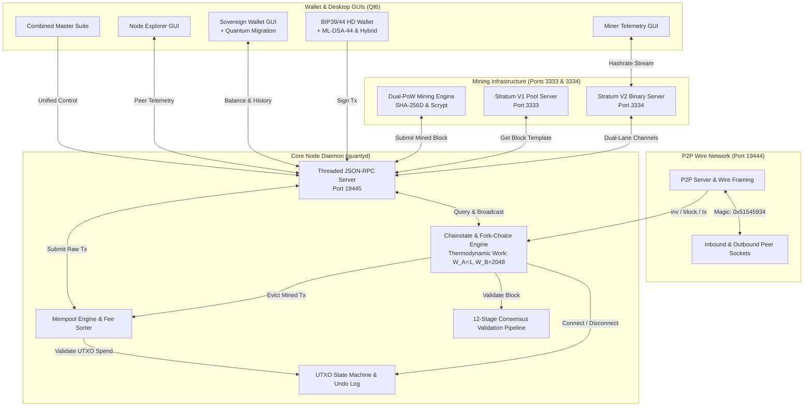

# QuantyCoin Technical Architecture Specification

**Protocol Version**: QTY4 (`70040`)  
**Network Identity**: QuantyCoin 4.0 (`quantycoin-4.0`)  
**Design Reference**: Independent Dual-PoW Layer-1 Protocol Architecture  

---

## 1. Architectural Overview

QuantyCoin is an independent Layer-1 cryptocurrency built on an asymmetric Dual Proof-of-Work mining architecture (Lane A SHA-256D ASIC & Lane B RFC 7914 Scrypt CPU/GPU). It incorporates native NIST FIPS 204 ML-DSA-44 post-quantum transaction authorization, cumulative thermodynamic chainwork, 32 MB block capacity, responsive per-lane LWMA-1 difficulty retargeting, pure 64-bit integer monetary arithmetic (`core.money.Amount`), native Stratum V2 binary framing (port 3334) and Stratum V1 (port 3333), multi-mode BIP39/44 HD wallets with Bech32m witness encodings (`qty1p...`, `qty1z...`), and a multi-threaded JSON-RPC interface.

---

## 2. Core Protocol Parameters (Protocol Freeze)

| Parameter | Value | Consensus Rule |
| :--- | :--- | :--- |
| **Protocol Version** | `70040` | Version handshake identifier (`PROTOCOL_VERSION`) |
| **Chain Identifier** | `quantycoin-4.0` | Independent chain identity (`CHAIN_ID`) |
| **Network Magic (Mainnet)** | `0x51545934` (`QTY4`) | 4-byte framing prefix on wire messages |
| **Default Ports** | P2P: `19444`, RPC: `19445`, SV1: `3333`, SV2: `3334` | Dedicated ports; zero conflict with Bitcoin or legacy networks |
| **Genesis Hash** | `000004eb1e117df3168d6d27118982e0a23c236120183e8390a6bbb82ee6fde3` | Authoritative root of consensus |
| **Genesis Merkle Root** | `3526817e09d5a065247d15a45a7aa5cf351479e011d32ecfd752e94acfae55ea` | Single coinbase transaction Merkle leaf |
| **Target Block Interval** | `60 seconds` combined | Expected time between blocks (120s per lane) |
| **Mining Lanes** | **Dual-PoW** | Lane A: SHA-256D (100% subsidy) &bull; Lane B: Scrypt (50% subsidy) |
| **Difficulty Algorithm** | **LWMA-1** | Linear-Weighted Moving Average across 45-block window per lane |
| **Fork Choice** | **Thermodynamic Chainwork** | Cumulative physical energy metric ($W_A=1, W_B=2048$) |
| **Max Block Size** | `32 MB` (33,554,432 bytes) | Enforced maximum raw serialized block length |
| **Genesis Reward** | `50 QTY` (5,000,000,000 Satoshis) | Initial subsidy per block (Lane A) |
| **Halving Interval** | `2,100,000 blocks` (~4 years) | Pure integer right-shift: `base >> (height // interval)` |
| **Max Supply Hard Cap** | `21,000,000 QTY` | Strictly finite supply (`core.money.Amount`) |
| **Coinbase Maturity** | `100 blocks` | Mined coins spendable only after 100 confirmations |
| **Post-Quantum Cryptography** | **NIST FIPS 204 ML-DSA-44** | Native C lattice acceleration (`libqtydilithium`) |
| **Address Encodings** | Bech32, Bech32m & Base58Check | Witness v0 (`qty1q...`), v1 ML-DSA (`qty1p...`), v2 Hybrid (`qty1z...`), Legacy (`Q...`) |

---

## 3. Subsystem Breakdown

### 1. `core/` (Consensus State Machine)
- `genesis_constants.py`: Frozen QTY4 constants, public genesis hash, and network identifiers.
- `money.py`: `Amount` class enforcing pure 64-bit integer arithmetic and zero floats.
- `block.py`: 80-byte header serialization with upper-16-bit `pow_type` encoding, dual-PoW evaluation, and Merkle tree verification.
- `transaction.py`: Multi-mode witness serialization (Classical, ML-DSA-44, Hybrid), TxID computation, and fail-closed verification.
- `consensus.py`: Independent per-lane LWMA-1 difficulty adjustment algorithm, thermodynamic chainwork weights, and integer subsidy halving.
- `validation.py`: 12-stage formal consensus validation pipeline.
- `utxo.py`: In-memory UTXO map with undo logs for rollback support.
- `mempool.py`: Ingestion, fee prioritization, ancestor tracking, and double-spend detection.

### 2. `crypto/` (Cryptographic Engine)
- `mldsa.py`: NIST FIPS 204 ML-DSA-44 key generation, signing, and verification backed by native `libqtydilithium` (zero pseudo-crypto fallbacks).
- `bip32_44.py`: Extended key derivation and Bech32/Bech32m address encoding for witness versions 0, 1, and 2.

### 3. `network/` (P2P Gossip Network)
- `protocol.py`: Wire message framing with magic `0x51545934`, command encoding, and checksum validation.
- `peer.py`: Individual peer socket state machine with keepalive ping/pong.
- `p2p_server.py`: Server socket listener on port 19444, peer exchange (PEX), and broadcast router.

### 4. `node/` (Daemon & RPC)
- `chainstate.py`: Active chain tip tracking, thermodynamic fork-choice resolution, and deep reorg coordination.
- `rpc_server.py`: Multi-threaded JSON-RPC 2.0 HTTP server on port 19445 with dual-PoW, chainwork, PQC, and migration RPC methods.
- `daemon.py`: Full node orchestrator lifecycle management.

### 5. `miner/` (Proof-of-Work & Pool Server)
- `engine.py`: Dual-lane CPU/GPU mining engine (SHA-256D and Scrypt) with real-time telemetry.
- `stratum.py`: TCP Stratum V1 server on port 3333.
- `stratum_v2.py`: Native Stratum V2 binary framing engine on port 3334 with dual-lane channel multiplexing.
- `cli.py`: Unified miner CLI with `--lane sha256d` and `--lane general`.

### 6. `wallet/` (Sovereign Key Management)
- `hd_wallet.py`: BIP39 mnemonic seed generation, BIP44 derivation, multi-mode transaction creation, and automated quantum migration.
- `rpc_client.py`: Client connection interface to node RPC server.

### 7. `ui/` (Native Qt6 Desktop Applications)
- `qt_node_app.py`: Standalone Node Manager with telemetry, explorer, and RPC console.
- `qt_wallet_full_app.py`: Sovereign wallet with integrated full node daemon and quantum audit.
- `qt_miner_app.py`: Standalone Miner GUI with live hashrate visualizer and dual-lane controls.
- `qt_suite_app.py`: Unified control center hosting all 4 modules.
