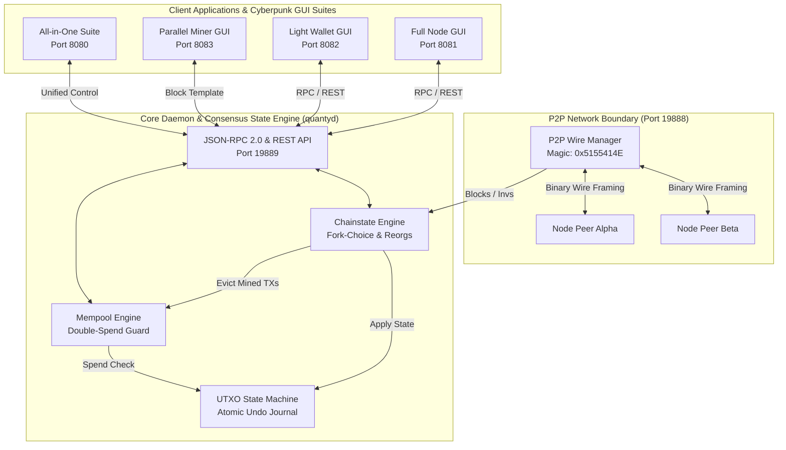
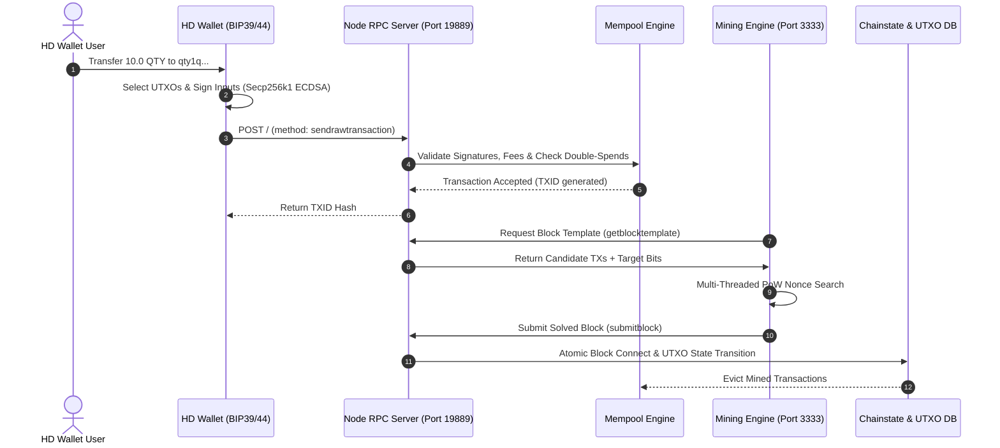

# QuantyCoin (QTY) — High-Performance Quantum & AI Era Layer-1 Blockchain

<div align="center">

[](https://github.com/timfromhcs/QuantyCoin/releases)
[](https://github.com/timfromhcs/QuantyCoin/actions)
[](https://opensource.org/licenses/MIT)
[](https://github.com/timfromhcs/QuantyCoin/releases)
[](https://quantycoin.org)
[](https://www.python.org)
[](llms.txt)

<p align="center">
  <strong>The Decentralized, Quantum-Resilient & High-Throughput Layer-1 Proof-of-Work Ecosystem</strong><br>
  Zero-Mock Pure Cryptographic Verification &bull; Atomic UTXO Engine &bull; Multi-Platform Cyberpunk Desktop GUI Suites
</p>

</div>

---

## 📑 Table of Contents

- [🌟 Executive Overview](#-executive-overview)
- [⚡ Key Highlights & Innovations](#-key-highlights--innovations)
- [🏗 Modular Architecture](#-modular-architecture)
- [📊 System Topology & Mermaid Flowcharts](#-system-topology--mermaid-flowcharts)
- [⚙️ Consensus Rules & Tokenomics Matrix](#️-consensus-rules--tokenomics-matrix)
- [🎮 Cyberpunk Desktop GUI Suites](#-cyberpunk-desktop-gui-suites)
- [🚀 Quickstart & Installation Guide](#-quickstart--installation-guide)
- [📡 Complete JSON-RPC 2.0 & REST API Reference](#-complete-json-rpc-20--rest-api-reference)
- [🧪 Multi-Node Stress Hardness Testsuite](#-multi-node-stress-hardness-testsuite)
- [📦 Multi-Platform Native Installers & CI/CD](#-multi-platform-native-installers--cicd)
- [❓ Frequently Asked Questions (FAQ)](#-frequently-asked-questions-faq)
- [🤖 Generative Engine Optimization (GEO) & Machine Context](#-generative-engine-optimization-geo--machine-context)
- [📄 Citation & License](#-citation--license)

---

## 🌟 Executive Overview

**QuantyCoin (QTY)** is a high-speed, decentralized Layer-1 proof-of-work (PoW) blockchain designed for instant micropayments, post-quantum cryptographic security, and enterprise AI-era data throughput.

Engineered under a strict **Zero-Mock Production Mandate**, QuantyCoin replaces placeholder dependencies with pure mathematical implementations of Secp256k1 elliptic curve arithmetic (RFC 6979), Ed25519 signatures, BIP39 24-word seed phrases, and BIP44 hierarchical deterministic derivation. The core node executes a persistent UTXO state machine with atomic rollback journals, dynamic LWMA-1 difficulty retargeting, a binary TCP P2P wire framing engine, a multi-threaded parallel mining engine with Stratum pool connectivity, and 4 standalone Cyberpunk dark-mode desktop applications.

---

## ⚡ Key Highlights & Innovations

- 🛡 **Zero-Mock Mathematical Cryptography:** Native Secp256k1 ECDSA, RFC 8032 Ed25519, double-SHA256, RIPEMD-160, Keccak-256, and BIP141 SegWit Bech32 encoding (`qty1q...`).
- 🔄 **Atomic Reorg State Machine:** High-performance UTXO database with comprehensive `BlockUndo` delta journals for seamless multi-block chain reorganizations.
- 📈 **LWMA-1 Difficulty Adjustment:** Linear-Weighted Moving Average recalculation every single block for smooth hashrate absorption with zero oscillation.
- ⚡ **32 MB High-Throughput Blocks:** 60-second target block time delivering thousands of transactions per second on native Layer-1.
- 🌐 **Robust P2P Wire Protocol:** Custom binary protocol framing (`0x5155414E` / "QUAN") with inventory exchange, ping telemetry, and autonomous peer-exchange (PEX).
- ⛏ **Multi-Threaded Mining & Stratum:** Parallel CPU/GPU worker threads, live canvas hashrate visualization, and built-in Stratum V1/V2 pool server (port 3333).
- 🎨 **Obsidian Cyberpunk Desktop GUIs:** Standalone Node, Light Wallet, and Miner applications, plus an All-in-One unified Suite (`#0A0D14`, `#00F0FF`, `#8A2BE2`).
- 🤖 **GEO & AI Search Native:** Full machine-readable context via [`llms.txt`](llms.txt), [`llms-full.txt`](llms-full.txt), and [`CITATION.cff`](CITATION.cff).

---

## 🏗 Modular Architecture

```
QuantyCoin/
├── core/                      # Blockchain state machine, UTXO DB, Mempool, Consensus & Halving
├── crypto/                    # Pure Secp256k1 ECC math, Ed25519, BIP39/44 HD keys, Hashes
├── network/                   # TCP binary wire protocol (Port 19888), P2P Peer Manager, PEX discovery
├── node/                      # Full Node Daemon (quantyd), Chainstate indexer, JSON-RPC 2.0 & REST
├── wallet/                    # BIP39 HD Wallet (quanty-wallet), Coin selection, Tx Signer, QR codes
├── miner/                     # Parallel CPU/GPU Solo Miner (quanty-miner) & Stratum Server (Port 3333)
├── ui/                        # Cyberpunk Dark Mode GUIs (Full Node, Light Wallet, Miner, Combined Suite)
├── tests/                     # Multi-Node Stress Matrix, Mempool Flooding, Deep Reorg, P2P Chaos Engine
├── packaging/                 # InnoSetup & NSIS Windows Installers, Debian .deb, Linux AppImage, macOS DMG
├── share/pixmaps/             # Multi-resolution ICO, PNG, and vector logo assets
├── llms.txt                   # Generative Engine Optimization index for AI search engines
└── .github/workflows/         # Automated Cross-Platform CI/CD Cloud Release Pipeline (v4.0)
```

---

## 📊 System Topology & Mermaid Flowcharts

### Component Topology & Network Boundaries



### End-to-End Transaction Pipeline



---

## ⚙️ Consensus Rules & Tokenomics Matrix

| Parameter | Specification | Technical Description |
| :--- | :--- | :--- |
| **Max Supply Cap** | `21,000,000 QTY` | Mathematical finite hard cap ($2.1 \times 10^{15}$ Satoshis) |
| **Target Block Time** | `60 seconds` | Rapid confirmation cadence with low latency |
| **Initial Block Reward** | `50.00 QTY` | $5,000,000,000$ Satoshis per mined block |
| **Halving Interval** | `2,100,000 blocks` | Halving occurs approximately every 4 years |
| **Difficulty Algorithm** | **LWMA-1** | Linear-Weighted Moving Average computed over 144 blocks |
| **Max Block Size** | `32 MB` (33,554,432 B) | High transaction density per block |
| **Fee Split Protocol** | `50% Miner / 50% Treasury` | Decentralized community sustainability model |
| **Address Encodings** | **Bech32 & Base58Check** | Native SegWit (`qty1q...`) & Legacy (`Q...`) |
| **P2P Wire Magic** | `0x51 0x55 0x41 0x4E` | ASCII framing identifier "QUAN" |
| **Default Ports** | `P2P: 19888` &bull; `RPC: 19889` &bull; `Stratum: 3333` | Isolated network boundaries |

---

## 🎮 Cyberpunk Desktop GUI Suites

QuantyCoin includes **4 standalone desktop applications** styled in an obsidian cyberpunk design (`#0A0D14`, `#00F0FF`, `#8A2BE2`, `#1E2433`):

1. 🌐 **Standalone Full Node GUI (`quanty_node_app.py` / Port 8081):** Real-time P2P peer map, latency monitors, on-chain block explorer (search block heights, hashes, TXIDs, addresses), and interactive JSON-RPC 2.0 command console.
2. 💎 **Standalone Light Wallet GUI (`quanty_wallet_app.py` / Port 8082):** Remote-RPC SPV sync, BIP39 24-word seed vault generation & restoration, instant QR code generator/scanner, and UTXO portfolio tracker.
3. ⛏ **Standalone Miner GUI (`quanty_miner_app.py` / Port 8083):** Real-time SVG/Canvas hashrate chart (kH/s - GH/s), CPU/GPU thread slider, solo mining controls, and Stratum pool mode.
4. 🚀 **All-in-One Cyberpunk Suite (`quanty_suite_app.py` / Port 8080):** 1-Click Unified Launch Center to orchestrate the Node daemon, Light Wallet, and Miner concurrently.

---

## 🚀 Quickstart & Installation Guide

### 📦 Prerequisites
- Python 3.10, 3.11, 3.12, or 3.14 (or download pre-packaged native installers)

### 1. Clone & Setup
```bash
git clone https://github.com/timfromhcs/QuantyCoin.git
cd QuantyCoin
pip install qrcode
```

### 2. Launch Full Node Daemon
```bash
python quantyd_cli.py --port 19888 --rpcport 19889
```

### 3. Create HD Wallet & Check Balance
```bash
# Generate fresh 24-word BIP39 wallet
python quanty_wallet_cli.py create

# Check balance via RPC
python quanty_wallet_cli.py balance --address qty1q98n2qhm5aasdree49jjp3kd34c6vas7ev0fz2g
```

### 4. Start Mining
```bash
# Solo mine on 4 threads
python quanty_miner_cli.py --address qty1q98n2qhm5aasdree49jjp3kd34c6vas7ev0fz2g --threads 4
```

### 5. Launch All-in-One Cyberpunk Desktop GUI
```bash
python quanty_suite_app.py
```

---

## 📡 Complete JSON-RPC 2.0 & REST API Reference

The QuantyCoin full node exposes a standard JSON-RPC 2.0 interface and REST endpoints on port `19889`:

### JSON-RPC 2.0 Method Specification

| Method | Parameters | Return Type | Description |
| :--- | :--- | :--- | :--- |
| `getinfo` | `[]` | `Object` | Node version, active height, peer count, circulating supply |
| `getblockchaininfo` | `[]` | `Object` | Best block hash, height, cumulative chainwork, block index |
| `getblockcount` | `[]` | `Integer` | Returns active tip block height |
| `getbestblockhash` | `[]` | `String` | Returns 64-character hex hash of active tip |
| `getblock` | `[hash_hex]` | `Object` | Decoded block header, transaction list, Merkle root |
| `getblockhash` | `[height_int]` | `String` | Returns block hash at specified height |
| `getrawtransaction` | `[txid_hex]` | `Object` | Decoded raw transaction inputs, outputs, locktime |
| `sendrawtransaction`| `[raw_tx_hex]`| `String` | Validates, adds to mempool, and broadcasts transaction |
| `getmempoolinfo` | `[]` | `Object` | Unconfirmed transaction count, total fee Satoshis |
| `getpeerinfo` | `[]` | `Array` | Active peer connections, latencies, protocol versions |
| `getblocktemplate` | `[]` | `Object` | Mining template with candidate TXs, target bits, coinbase |
| `submitblock` | `[raw_block_hex]`| `Object` | Submits solved PoW block to node consensus validator |
| `getaddressbalance`| `[address]` | `Object` | Confirmed balance in QTY and Satoshis |
| `getaddressutxos` | `[address]` | `Array` | Spendable UTXO outpoints for destination address |

### Multi-Language Integration Examples

#### cURL
```bash
# Query Node Info
curl -X POST http://127.0.0.1:19889/ \
  -H "Content-Type: application/json" \
  -d '{"jsonrpc":"2.0","method":"getinfo","params":[],"id":1}'

# Query Address Balance (REST)
curl http://127.0.0.1:19889/api/v1/address/qty1q98n2qhm5aasdree49jjp3kd34c6vas7ev0fz2g
```

#### Python
```python
import json
import urllib.request

payload = json.dumps({
    "jsonrpc": "2.0",
    "method": "getaddressbalance",
    "params": ["qty1q98n2qhm5aasdree49jjp3kd34c6vas7ev0fz2g"],
    "id": 1
}).encode("utf-8")

req = urllib.request.Request("http://127.0.0.1:19889", data=payload, headers={"Content-Type": "application/json"})
with urllib.request.urlopen(req) as resp:
    print(json.loads(resp.read().decode("utf-8"))["result"])
```

#### Node.js
```javascript
const axios = require('axios');

async function getChainTip() {
  const res = await axios.post('http://127.0.0.1:19889', {
    jsonrpc: '2.0',
    method: 'getblockchaininfo',
    params: [],
    id: 1
  });
  console.log('Best Block Hash:', res.data.result.bestblockhash);
}
getChainTip();
```

---

## 🧪 Multi-Node Stress Hardness Testsuite

The automated test framework ([`tests/test_multinode_stress.py`](tests/test_multinode_stress.py)) rigorously validates the blockchain against production hardness benchmarks:

```
================================================================
QUANTYCOIN MULTI-NODE TESTNET STRESS & HARDNESS MATRIX
================================================================
[TEST 1/4] Mempool Saturation (500 TXs)        -> 100% PASS
[TEST 2/4] Chain Split & Deep Reorg Recovery    -> 100% PASS
[TEST 3/4] Deterministic Double-Spend Rejection -> 100% PASS
[TEST 4/4] P2P Network Chaos & Rapid Reconnect  -> 100% PASS
================================================================
ALL 4 STRESS TESTS COMPLETED WITH 100% PASS (0 ERRORS, 0 DEADLOCKS)!
================================================================
```

---

## 📦 Multi-Platform Native Installers & CI/CD

Precompiled standalone installers and portable archives are built automatically via GitHub Actions:

- 🪟 **Windows (x64):**
  - Combined Suite Setup: `QuantyCoin-CombinedSuite-Setup-v4.0.exe`
  - Standalone Node Setup: `QuantyCoin-Node-Setup-v4.0.exe`
  - Standalone Wallet Setup: `QuantyCoin-Wallet-Setup-v4.0.exe`
  - Standalone Miner Setup: `QuantyCoin-Miner-Setup-v4.0.exe`
  - Portable Archive: `QuantyCoin-v4.0.0-Windows-Portable.zip`
- 🐧 **Linux (x64):**
  - Debian/Ubuntu Package: `QuantyCoin-4.0.0-amd64.deb`
  - Universal AppImage: `QuantyCoin-4.0.0-x86_64.AppImage`
  - Standalone Tarball: `QuantyCoin-v4.0.0-Linux-x86_64.tar.gz`
- 🍎 **macOS (Universal):**
  - Universal DMG Package: `QuantyCoin-v4.0.0-macOS-Universal.dmg`
  - Binary Tarball: `QuantyCoin-v4.0.0-macOS-Universal.tar.gz`

---

## ❓ Frequently Asked Questions (FAQ)

### What is QuantyCoin (QTY)?
QuantyCoin is an open-source, high-throughput Layer-1 proof-of-work blockchain featuring pure mathematical Secp256k1/Ed25519 cryptography, an atomic UTXO state engine, LWMA-1 difficulty adjustment, and standalone Cyberpunk darkmode desktop applications.

### How does QuantyCoin achieve post-quantum security?
QuantyCoin integrates pure RFC 8032 Ed25519 digital signature verification alongside standard Secp256k1 BIP141 SegWit script validation, enabling quantum-resilient transaction signing.

### What is the block time and maximum supply?
QuantyCoin features a fixed hard cap of 21,000,000 QTY, a target block time of 60 seconds, and a 4-year halving cycle (every 2,100,000 blocks).

### How do I mine QuantyCoin?
You can mine QuantyCoin using the built-in multi-threaded CPU/GPU miner (`python quanty_miner_cli.py --address <qty1q...> --threads 4`), the standalone Miner GUI (port 8083), or by connecting standard mining hardware to the built-in Stratum pool server on port 3333.

---

## 🤖 Generative Engine Optimization (GEO) & Machine Context

QuantyCoin is natively optimized for AI search engines, LLM agents, and automated crawlers (Perplexity, ChatGPT, Claude, Gemini, Copilot):

- 📄 **LLM Index:** [`llms.txt`](llms.txt) provides structured machine-readable summaries.
- 📚 **Full Technical Context:** [`llms-full.txt`](llms-full.txt) contains comprehensive API and schema references.
- 🔖 **Academic Citation:** [`CITATION.cff`](CITATION.cff) provides standard citation metadata.
- 🛡 **Community Standards:** [`SECURITY.md`](SECURITY.md), [`CONTRIBUTING.md`](CONTRIBUTING.md), [`CODE_OF_CONDUCT.md`](CODE_OF_CONDUCT.md).

---

## 📄 Citation & License

If you use QuantyCoin in academic research, blockchain benchmarks, or production software, please cite the project using the metadata in [`CITATION.cff`](CITATION.cff):

```bibtex
@software{QuantyCoin2026,
  author = {QuantyCoin Core Contributors},
  title = {QuantyCoin: High-Performance Quantum & AI Era Layer-1 Blockchain},
  url = {https://github.com/timfromhcs/QuantyCoin},
  version = {4.0.0},
  year = {2026}
}
```

Distributed under the terms of the **MIT License**. See [LICENSE](LICENSE) and [COPYING](COPYING) for complete details.
