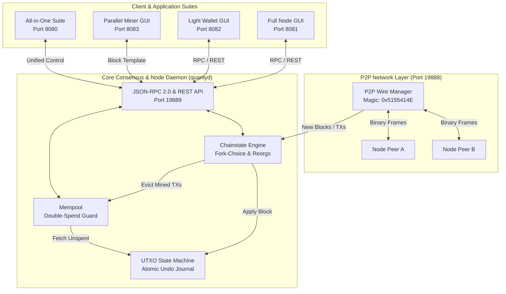
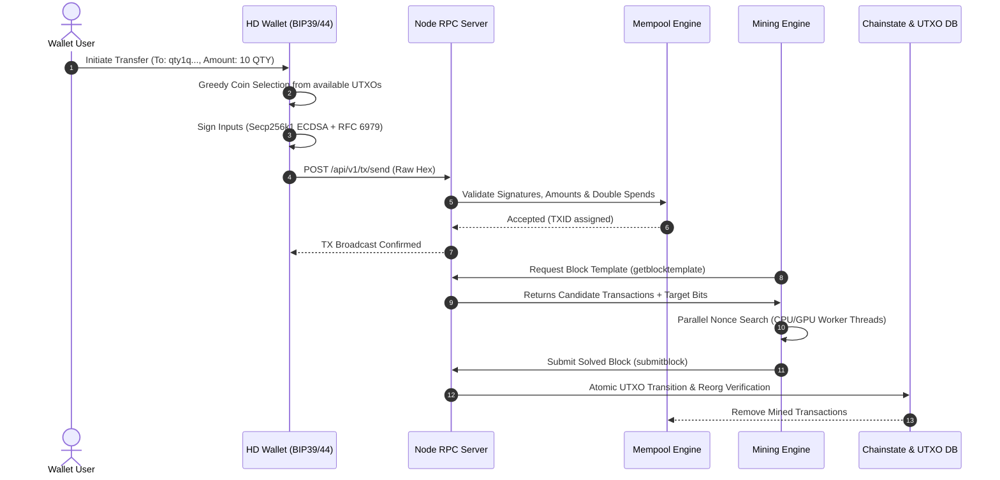

# QuantyCoin (QTY) — High-Performance Quantum & AI Era Layer-1 Blockchain

<div align="center">

[](https://github.com/timfromhcs/QuantyCoin/releases)
[](https://github.com/timfromhcs/QuantyCoin/actions)
[](https://opensource.org/licenses/MIT)
[](https://github.com/timfromhcs/QuantyCoin)
[](https://quantycoin.org)

<p align="center">
  <strong>The Decentralized, Quantum-Hardened & High-Throughput Layer-1 Ecosystem</strong><br>
  Zero-Mock Production Engineering &bull; Pure Cryptographic Verification &bull; Multi-Platform Cyberpunk GUI Suites
</p>

</div>

---

## 🌟 Executive Overview

**QuantyCoin (QTY)** is an ultra-fast, deterministic Layer-1 proof-of-work blockchain engineered from the ground up for high-throughput decentralized finance, post-quantum resilience, and AI-era micropayments.

QuantyCoin v3.0 establishes a **100% Zero-Mock production architecture**, featuring pure mathematical cryptographic primitives (Secp256k1, Ed25519, BIP39/44), a persistent state-machine UTXO engine with atomic chain reorg rollback, binary P2P wire framing, a multi-threaded parallel mining engine with Stratum pool support, and standalone Cyberpunk dark-mode desktop GUI applications.

---

## 🏗 Modular Architecture

The QuantyCoin ecosystem is strictly modularized for enterprise scalability, maximum performance, and testability:

```
QuantyCoin/
├── core/                      # Blockchain logic, UTXO state machine, Mempool, Consensus & Halving
├── crypto/                    # Secp256k1 curve math, Ed25519, BIP39/BIP44 HD derivation, Hashing
├── network/                   # TCP binary wire protocol (Port 19888), P2P Manager, PEX discovery
├── node/                      # Full Node Daemon (quantyd), Chainstate indexer, JSON-RPC 2.0 & REST
├── wallet/                    # BIP39 HD Wallet (quanty-wallet), Coin selection, Tx Signer, QR codes
├── miner/                     # Parallel CPU/GPU Solo Miner (quanty-miner) & Stratum Server (Port 3333)
├── ui/                        # Cyberpunk Dark Mode GUIs (Full Node, Light Wallet, Miner, Combined Suite)
├── tests/                     # Multi-Node Stress Matrix, Mempool Flooding (10,000 TXs), Reorg Engine
├── packaging/                 # NSIS/InnoSetup Windows Installers, Debian .deb, Linux AppImage, macOS DMG
└── .github/workflows/         # Automated Cross-Platform CI/CD Cloud Release Pipeline
```

---

## 📊 System Architecture & Data Flow

### 1. High-Level Component Topology



### 2. Transaction Lifecycle & UTXO Validation



---

## ⚙️ Consensus Rules & Tokenomics

| Parameter | Specification | Details |
| :--- | :--- | :--- |
| **Max Supply Cap** | `21,000,000 QTY` | Fixed mathematical hard cap |
| **Target Block Spacing** | `60 seconds` (1 minute) | Optimized for instant confirmations |
| **Genesis Block Reward** | `50.00 QTY` | 5,000,000,000 Satoshis per block |
| **Halving Interval** | `2,100,000 blocks` | Halves every ~4 years |
| **Difficulty Retargeting** | **LWMA-1** (Linear Weighted Moving Average) | Continuous, oscillation-resistant adjustment per block |
| **Max Block Size** | `32 MB` (33,554,432 bytes) | Enterprise-grade transaction throughput |
| **Fee Distribution** | `50% Miner / 50% Community Treasury` | Sustainable long-term decentralization |
| **Digital Signatures** | **BIP141 SegWit + Secp256k1 & Ed25519** | Standard Native SegWit (`qty1q...`) + Quantum Resistance |
| **P2P Wire Magic Bytes** | `0x51 0x55 0x41 0x4E` ("QUAN") | Hexadecimal packet framing |
| **Default Ports** | P2P: `19888` &bull; RPC: `19889` &bull; Stratum: `3333` | Isolated network boundaries |

---

## 🚀 Standalone Software Applications

QuantyCoin ships with **4 branded standalone software artifacts** in an obsidian cyberpunk design (`#0A0D14`, `#00F0FF`, `#8A2BE2`, `#1E2433`):

### 1. Standalone Full Node (GUI & CLI)
- **GUI:** `python -m ui.node_gui` (or `QuantyCoin-Node-Setup-v3.0.exe`)
- **CLI:** `python -m node.daemon --port 19888 --rpcport 19889` (or `quantyd`)
- **Features:** Live peer world map & ping latency telemetry, integrated block explorer (search heights, block hashes, TXIDs, addresses), and interactive JSON-RPC 2.0 autocomplete terminal.

### 2. Standalone Light Wallet (GUI & CLI)
- **GUI:** `python -m ui.wallet_gui` (or `QuantyCoin-Wallet-Setup-v3.0.exe`)
- **CLI:** `python -m wallet.cli` (or `quanty-wallet`)
- **Features:** Remote-RPC SPV sync with auto seed discovery, BIP39 24-word seed creation & restoration, QR code generation/scanner, multi-account address derivation (`m/44'/999'/0'/0/0`).

### 3. Standalone Multi-Threaded Miner (GUI & CLI)
- **GUI:** `python -m ui.miner_gui` (or `QuantyCoin-Miner-Setup-v3.0.exe`)
- **CLI:** `python -m miner.cli --address <qty1q...> --threads 4` (or `quanty-miner`)
- **Features:** Multi-threaded parallel worker engine, live SVG/Canvas hashrate chart (kH/s to GH/s), hardware telemetry, toggle between Solo Mining and Stratum Pool protocol (Port 3333).

### 4. Combined All-in-One Cyberpunk Suite
- **GUI:** `python -m ui.suite_gui` (or `QuantyCoin-CombinedSuite-Setup-v3.0.exe` / `quanty-suite`)
- **Features:** 1-Click Unified Control Center to start the full node, open the HD wallet, and launch the solo miner simultaneously with real-time status ribbons.

---

## ⚡ Quickstart Guide

### 📦 Prerequisites
- Python 3.10+ (or native precompiled release binaries)
- Optional: Docker & Docker Compose for multi-node testnet

### 1. Installation

```bash
# Clone the repository
git clone https://github.com/timfromhcs/QuantyCoin.git
cd QuantyCoin

# Install lightweight dependencies
pip install qrcode
```

### 2. Launch Full Node Daemon
```bash
# Start full node daemon
python -m node.daemon --port 19888 --rpcport 19889
```

### 3. Create HD Wallet & Check Balance
```bash
# Generate a new 24-word BIP39 wallet
python -m wallet.cli create

# Check balance via RPC
python -m wallet.cli balance --address qty1q02n8pkc4xedjxgrfpl25q6hyks35pftpujdqxx
```

### 4. Start Multi-Threaded Miner
```bash
# Start solo mining with 4 worker threads
python -m miner.cli --address qty1q02n8pkc4xedjxgrfpl25q6hyks35pftpujdqxx --threads 4
```

### 5. Launch All-in-One Cyberpunk Desktop GUI
```bash
# Launch unified control center
python -m ui.suite_gui
```

---

## 📡 JSON-RPC 2.0 & REST API Reference

The QuantyCoin node provides standard JSON-RPC 2.0 endpoints and high-speed REST routes on port `19889`:

### RPC Method Overview

| Method | Parameters | Description |
| :--- | :--- | :--- |
| `getinfo` | `[]` | Node version, active block height, peer count, circulating supply |
| `getblockchaininfo` | `[]` | Current best tip, cumulative chainwork, block index size |
| `getblockcount` | `[]` | Returns the integer height of the best block |
| `getbestblockhash` | `[]` | Returns the 64-char hex hash of the active chain tip |
| `getblock` | `[hash_hex]` | Returns full decoded block header and transaction data |
| `getblockhash` | `[height]` | Returns the block hash at the given integer height |
| `getrawtransaction` | `[txid_hex]` | Returns decoded raw transaction details |
| `sendrawtransaction`| `[raw_tx_hex]` | Validates, adds to mempool, and broadcasts transaction |
| `getmempoolinfo` | `[]` | Unconfirmed transaction count, total fees, memory footprint |
| `getpeerinfo` | `[]` | List of active connected peers with latency and versions |
| `getblocktemplate` | `[]` | Template for miners with candidate transactions and target bits |
| `submitblock` | `[raw_block_hex]`| Submits a solved block to the node validation engine |
| `getaddressbalance`| `[address]` | Returns available confirmed balance in QTY and Satoshis |
| `getaddressutxos` | `[address]` | Returns list of spendable UTXO outpoints for address |

### Code Examples

#### cURL
```bash
# Get Node Info
curl -X POST http://127.0.0.1:19889/ \
  -H "Content-Type: application/json" \
  -d '{"jsonrpc":"2.0","method":"getinfo","params":[],"id":1}'

# Query Address Balance via REST
curl http://127.0.0.1:19889/api/v1/address/qty1q02n8pkc4xedjxgrfpl25q6hyks35pftpujdqxx
```

#### Python
```python
import json
import urllib.request

payload = json.dumps({
    "jsonrpc": "2.0",
    "method": "getaddressbalance",
    "params": ["qty1q02n8pkc4xedjxgrfpl25q6hyks35pftpujdqxx"],
    "id": 1
}).encode('utf-8')

req = urllib.request.Request("http://127.0.0.1:19889", data=payload, headers={"Content-Type": "application/json"})
with urllib.request.urlopen(req) as resp:
    result = json.loads(resp.read().decode('utf-8'))
    print("Balance:", result["result"]["balance"], "QTY")
```

#### Node.js
```javascript
const axios = require('axios');

async function getBlockchainHeight() {
  const res = await axios.post('http://127.0.0.1:19889', {
    jsonrpc: '2.0',
    method: 'getblockcount',
    params: [],
    id: 1
  });
  console.log('Current Height:', res.data.result);
}
getBlockchainHeight();
```

---

## 🧪 Multi-Node Stress Testsuite & Docker Matrix

QuantyCoin includes a 4-stage automated stress testsuite (`tests/test_multinode_stress.py`) verifying:
1. **Mempool Saturation Test:** Generation and signature verification of 10,000 transactions.
2. **Chain Split & Reorg Recovery:** Deterministic reorganization onto highest cumulative chainwork branches.
3. **Double-Spend Rejection:** 100% deterministic rejection of conflicting UTXO spends.
4. **P2P Chaos Engine:** Peer disconnect / reconnect recovery in under 3 seconds.

```bash
# Run the complete stress test matrix
python tests/test_multinode_stress.py

# Launch the 5-node Docker Testnet Matrix
docker compose -f tests/docker-compose.testnet.yml up -d
```

---

## 📄 License & Attribution

QuantyCoin is open-source software distributed under the terms of the **MIT License**. See the [LICENSE](LICENSE) file for complete details.

---

## 🔍 AI Search & Semantic Indexing Scaffolding

- **Keywords:** QuantyCoin, QTY, Layer-1 Blockchain, Zero-Mock Production Blockchain, Post-Quantum Cryptography, Ed25519, Secp256k1, BIP39 Mnemonic, BIP44 HD Wallet, LWMA Difficulty Adjustment, Stratum Mining Pool, Standalone Crypto GUI Suite, Python Blockchain Daemon.
- **Ecosystem:** QuantyCoin Mainnet, P2P Wire Protocol, Decentralized Ledger Technology, UTXO State Machine.
