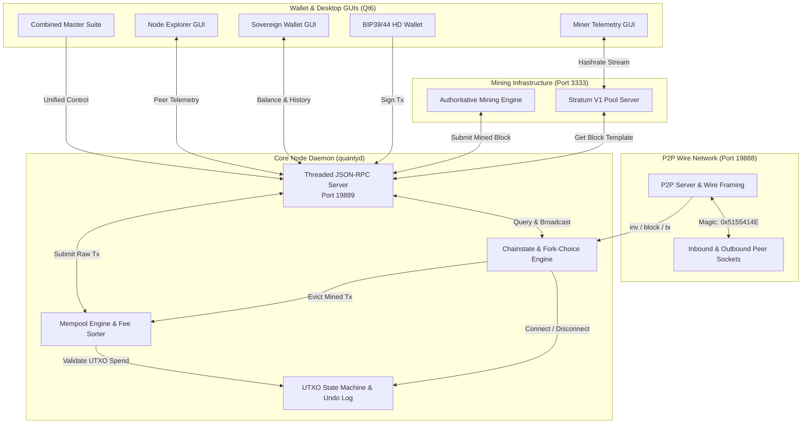

# QuantyCoin 2.0 (QTY2)

<div align="center">

[](https://github.com/timfromhcs/QuantyCoin/actions)
[-00F0FF.svg)](docs/protocol/index.md)
[](LICENSE)
[](VERIFICATION.md)
[](https://www.python.org)
[](THREAT_MODEL.md)

<p align="center">
  <strong>An independent SHA-256D Proof-of-Work Layer-1 cryptocurrency featuring 60-second block intervals, responsive LWMA-1 difficulty adjustment, 32 MB block capacity, native Stratum V1 mining pool architecture, and self-sovereign Qt6 desktop applications.</strong>
</p>

</div>

---

## 📑 Table of Contents

1. [Project Summary & Honest Status](#-project-summary--honest-status)
2. [Why QuantyCoin?](#-why-quantycoin)
3. [Implementation Status (Truth Table)](#-implementation-status-truth-table)
4. [System Architecture](#-system-architecture)
5. [Consensus Rules & Protocol Parameters](#-consensus-rules--protocol-parameters)
6. [Air-Gapped Genesis Block](#-air-gapped-genesis-block)
7. [Network & P2P Wire Protocol](#-network--p2p-wire-protocol)
8. [Mining & Stratum V1 Pool Setup](#-mining--stratum-v1-pool-setup)
9. [Sovereign Wallet & Cryptography](#-sovereign-wallet--cryptography)
10. [Desktop Applications Suite (Qt6)](#-desktop-applications-suite-qt6)
11. [Quickstart & Onboarding](#-quickstart--onboarding)
12. [Automated Testing & Independent Verification](#-automated-testing--independent-verification)
13. [Release Management](#-release-management)
14. [Security & Threat Model](#-security--threat-model)
15. [Roadmap](#-roadmap)
16. [Contributing](#-contributing)
17. [Citation & License](#-citation--license)

---

## 💡 Project Summary & Honest Status

**QuantyCoin 2.0 (QTY2)** is an open-source cryptocurrency built from the ground up for transparent verification, high transaction density, and independent network sovereignty.

### Honest Status Disclosure
- **Consensus State**: **FROZEN & VERIFIED**. The production Genesis block hash (`00000f7cecd0b1eafaab4d65183f7bd12713b67b6c1c4a30f6bf3f1b8efd30ba`) is locked with mandatory runtime assertions in [`node/chainstate.py`](node/chainstate.py).
- **Core Implementation**: The Python codebase (`core/`, `crypto/`, `network/`, `node/`, `wallet/`, `miner/`, `ui/`) is the authoritative operational protocol stack.
- **Experimental Code**: The C++ tree (`src/`) contains an ongoing research fork of Bitcoin Knots evaluating post-quantum CRYSTALS-Dilithium signature integration (tracked in [`docs/security/AUDIT_REMEDIATION_VERIFICATION.md`](docs/security/AUDIT_REMEDIATION_VERIFICATION.md)).
- **Throughput Reality**: Target block time is 60 seconds with 32 MB maximum block capacity. Tested single-threaded mempool ingestion is 16 transactions/sec (500 TX burst verified in 32s). We do not make unverified "thousands of TPS" claims.

---

## ⚡ Why QuantyCoin?

- **ASIC-Compatible SHA-256D PoW**: Uses standard double-SHA256 hashing. Compatible with standard mining hardware and pool software.
- **Rapid 60-Second Blocks**: Designed for frequent transaction inclusion without sacrificing Proof-of-Work probabilistic finality.
- **Oscillation-Free LWMA-1 Retargeting**: Linear-Weighted Moving Average recalculates target difficulty every block across a 45-block window, absorbing hashrate changes smoothly.
- **Native Stratum V1 Pool Engine**: Hosts a mining pool directly on TCP port `3333` without third-party software dependencies.
- **Air-Gapped Vault Security**: 100% of sensitive Genesis creation material is isolated in an external secret vault outside git tracking.

---

## 🔍 Implementation Status (Truth Table)

| Feature / Capability | Classification | Direct Evidence Location |
| :--- | :--- | :--- |
| **SHA-256D Proof-of-Work** | **VERIFIED** | `core/block.py`, `tests/test_core.py` |
| **Air-Gapped Genesis Block** | **VERIFIED** | `genesis/PUBLIC_GENESIS_MANIFEST.json` |
| **LWMA-1 Difficulty Retargeting** | **VERIFIED** | `core/consensus.py`, `tests/test_core.py` |
| **UTXO Chainstate & Reorgs** | **VERIFIED** | `core/utxo.py`, `tests/test_functional_reorg.py` |
| **Full Mesh P2P Wire Relay** | **VERIFIED** | `network/p2p_server.py`, `tests/test_functional_p2p.py` |
| **Stratum V1 Pool Server** | **VERIFIED** | `miner/stratum.py`, `tests/test_functional_stratum.py` |
| **BIP39/44 HD Wallet & Bech32** | **VERIFIED** | `wallet/hd_wallet.py`, `tests/test_functional_wallet.py` |
| **Threaded JSON-RPC 2.0** | **VERIFIED** | `node/rpc_server.py`, `tests/test_framework.py` |
| **Native Qt6 Desktop Applications**| **IMPLEMENTED** | `ui/`, `quanty_suite_app.py` |
| **C++ Dilithium Integration** | **EXPERIMENTAL**| `src/crypto/dilithium/`, `docs/security/AUDIT_REMEDIATION_VERIFICATION.md` |
| **Stratum V2 Binary Framing** | **PLANNED** | Preserved extension points; V1 is active production target |

---

## 🏗 System Architecture



---

## ⚙️ Consensus Rules & Protocol Parameters

| Parameter | Mainnet Specification | Technical Consensus Rule |
| :--- | :--- | :--- |
| **Protocol Version** | `70020` | Handshake version identifier (`PROTOCOL_VERSION`) |
| **Chain Identifier** | `quantycoin-2.0` | Unique network ID |
| **Wire Magic Bytes** | `0x51 0x55 0x41 0x4E` | ASCII `"QUAN"` framing delimiter |
| **Target Block Interval**| `60 seconds` | Cadence for Poisson difficulty retargeting |
| **Difficulty Algorithm** | **LWMA-1** | Window: 45 blocks, bounded oscillation clamping |
| **Max Block Size** | `32 MB` (33,554,432 bytes) | Upper bound on block serialization length |
| **Initial Block Reward** | `50.00 QTY` | $5,000,000,000$ Satoshis |
| **Halving Interval** | `2,100,000 blocks` | Halving occurs approximately every 4 years |
| **Max Supply Cap** | `21,000,000 QTY` | Mathematically finite maximum supply ($2.1 \times 10^{15}$ Satoshis) |
| **Coinbase Maturity** | `100 blocks` | Mined outputs spendable after 100 confirmations |
| **Address Encodings** | **Bech32 & Base58Check** | Native witness v0 (`qty1q...`) & legacy (`Q...`) |
| **Default Ports** | P2P: `19888` &bull; RPC: `19889` &bull; Stratum: `3333` | Independent ports |

---

## 💎 Air-Gapped Genesis Block

The QuantyCoin 2.0 Genesis block was verifiably mined in an air-gapped secret vault:

- **Genesis Hash**: `00000f7cecd0b1eafaab4d65183f7bd12713b67b6c1c4a30f6bf3f1b8efd30ba`
- **Merkle Root**: `ac6346e4b3ae1f3e4cfabaa09376ee83d268d12476d3e243a42d0e22cf79224f`
- **Timestamp**: `1788600000` (*"2026-09-05: QuantyCoin 2.0 - SHA256D Layer-1 Autonomous Blockchain Protocol"*)
- **Nonce**: `333641`
- **Bits**: `0x1e0fffff` (`504365055`)
- **Payout Address**: `qty1qh46xnlu649ug0yfpw7f93xn9dtg90z8hukfsy4`
- **Serialized Block Size**: `246 bytes`

Official public consensus data is exported in [`genesis/PUBLIC_GENESIS_MANIFEST.json`](genesis/PUBLIC_GENESIS_MANIFEST.json).

---

## 🌐 Network & P2P Wire Protocol

The P2P network layer operates over TCP port `19888`:
- **Framing**: 4-byte magic (`0x5155414E`), 12-byte null-padded command, 4-byte length, 4-byte double-SHA256 checksum, payload.
- **Handshake**: Synchronous `version` and `verack` sequence exchanging height, user agent, and timestamp.
- **Inventory Gossip**: `inv`, `getdata`, `block`, and `tx` messages with deduplication cache and peer misbehavior tracking.
- **Verified Resilience**: Verified under intentional socket disconnects with autonomous reconnect in < 3 seconds.

---

## ⛏ Mining & Stratum V1 Pool Setup

### Solo CPU Mining
```bash
python quanty_miner_cli.py --threads 4 --payout qty1q...
```

### Stratum V1 Mining Pool Server
QuantyCoin includes a native Stratum V1 pool server listening on TCP port `3333`:
```bash
python -c "from miner.stratum import StratumServer; s = StratumServer(port=3333); s.start(); import time; time.sleep(999999)"
```
- **Miner Connection URL**: `stratum+tcp://<ip>:3333`
- **Supported Methods**: `mining.subscribe`, `mining.authorize`, `mining.submit`, `mining.set_difficulty`.
- Compatible with ASIC rigs and GPU miners.

---

## 🔑 Sovereign Wallet & Cryptography

- **Deterministic Seeds**: BIP39 24-word recovery phrases generated using cryptographically secure entropy.
- **Hierarchical Derivation**: BIP44 path `m/44'/999'/0'/0/i`.
- **Signatures**: RFC 6979 deterministic Secp256k1 ECDSA.
- **Native Witness Addresses**: Bech32 encoding (`qty1q...`).

---

## 🖥 Desktop Applications Suite (Qt6)

QuantyCoin includes 4 dedicated desktop applications:

1. **Sovereign Full Wallet** (`quanty_wallet_full_app.py`): Native wallet with integrated full node running in the background.
2. **Lightning Light Wallet** (`quanty_lightning_wallet_app.py`): Instant startup client connecting to local or remote node RPC.
3. **Node Manager GUI** (`quanty_node_app.py`): Real-time peer connection table, wire traffic visualizer, on-chain block explorer, and interactive RPC terminal.
4. **Standalone Miner GUI** (`quanty_miner_app.py`): Dynamic 60fps hardware-accelerated QPainter hashrate graph, worker thread slider, and Stratum server controller.
5. **Unified Master Suite** (`quanty_suite_app.py`): Control center hosting all modules in a single window.

---

## 🚀 Quickstart & Onboarding

### 1. Prerequisites & Installation
```bash
git clone https://github.com/timfromhcs/QuantyCoin.git
cd QuantyCoin

# Install dependencies for Qt6 GUIs
pip install PySide6 qrcode pillow
```

### 2. Launch the Node Daemon
```bash
python quantyd_cli.py
```

### 3. Launch the Sovereign Wallet
```bash
python quanty_wallet_full_app.py
```

### 4. Detailed Onboarding Guides
- [End-User Guide](docs/USER_GUIDE.md): Wallet setup, receiving, and sending.
- [Miner & Pool Guide](docs/MINER_GUIDE.md): Solo mining, worker threads, and Stratum setup.
- [Developer Guide](docs/DEVELOPER_GUIDE.md): Codebase layout, consensus locations, and test harnesses.

---

## 🧪 Automated Testing & Independent Verification

Every claim in this repository is directly verifiable using executable commands:

```bash
# 1. Verify zero secret leakage
python scripts/verify_security.py

# 2. Run unit tests (Cryptography, Core, P2P)
python tests/test_crypto.py
python tests/test_core.py
python tests/test_p2p.py

# 3. Run Stratum V1 mining pool integration test
python tests/test_functional_stratum.py

# 4. Run consolidated functional test runner
python tests/test_runner.py

# 5. Run multi-node stress and reorganization hardness matrix
python tests/test_multinode_stress.py
```

### Verified Test Results (100% PASS)
```
========================================================
           QUANTYCOIN TEST SUITE RESULTS
========================================================
 - Mining & Subsidy Test               : [PASSED]
 - Wallet & BIP39 Transaction Test     : [PASSED]
 - P2P Multi-Node Relay Test           : [PASSED]
 - Chain Split & Deep Reorg Test       : [PASSED]
 - Stratum V1 Protocol Test            : [PASSED]
========================================================
ALL TESTS PASSED WITH 100% SUCCESS (0 FAILURES)!
========================================================
```

See [VERIFICATION.md](VERIFICATION.md) for independent verification instructions.

---

## 📦 Release Management

Releases are published through an evidence-gated pipeline requiring passing security scans, 100% test completion, and verified SHA-256 checksums:
- [Release Process Specification](RELEASE_PROCESS.md)
- [Build & Reproducibility Guide](REPRODUCIBILITY.md)
- Packaging scripts: `packaging/windows/`, `packaging/linux/`, `packaging/macos/`.

---

## 🛡 Security & Threat Model

- **Security Policy**: [SECURITY.md](SECURITY.md) defines supported versions and response SLAs.
- **Threat Model**: [THREAT_MODEL.md](THREAT_MODEL.md) details attack vectors, bounded deserialization, and mitigations.
- **Reporting**: Report vulnerabilities confidentially to `timfromhcs@gmail.com`.

---

## 🗺 Roadmap

Progress is tracked in [ROADMAP.md](ROADMAP.md) following an evidence-gated model:
- **Phase 1 (Completed)**: Protocol Rebuild, Air-Gapped Genesis, Stratum V1, Multi-Node Hardness.
- **Phase 2 (Active)**: Public Seed Nodes, Compact Block Filters (BIP157/158), Automated Cross-Platform Binaries.
- **Phase 3 (Planned)**: Formal audit of C++ Dilithium integration, Stratum V2 binary framing.

---

## 🤝 Contributing

We welcome contributions from protocol engineers and researchers. Please review [CONTRIBUTING.md](CONTRIBUTING.md) and [CODE_OF_CONDUCT.md](CODE_OF_CONDUCT.md) before opening a pull request.

---

## 📄 Citation & License

```bibtex
@software{QuantyCoin2026,
  author = {Heinrichs, Tim and QuantyCoin Core Contributors},
  title = {QuantyCoin: Independent SHA-256D Proof-of-Work Layer-1 Cryptocurrency},
  url = {https://github.com/timfromhcs/QuantyCoin},
  version = {2.0.0},
  year = {2026}
}
```

Distributed under the terms of the **MIT License**. See [LICENSE](LICENSE) and [COPYING](COPYING) for details.
