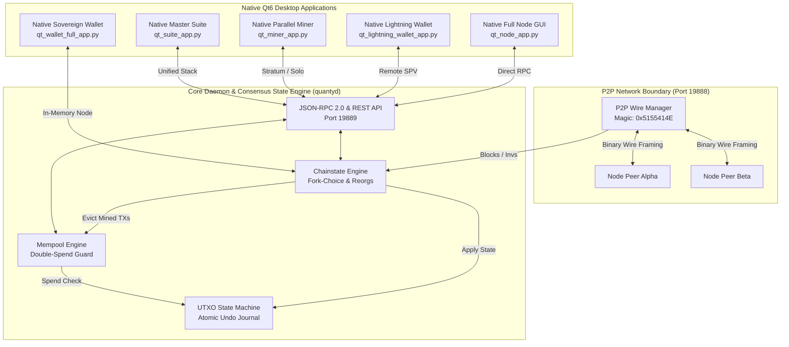

# QuantyCoin (QTY) — High-Performance Quantum & AI Era Layer-1 Blockchain

<div align="center">

[](https://github.com/timfromhcs/QuantyCoin/releases)
[](https://github.com/timfromhcs/QuantyCoin/actions)
[](https://opensource.org/licenses/MIT)
[](https://github.com/timfromhcs/QuantyCoin/releases)
[](https://quantycoin.org)
[](https://www.python.org)
[](llms.txt)

<p align="center">
  <strong>The Decentralized, Quantum-Resilient & High-Throughput Layer-1 Proof-of-Work Ecosystem</strong><br>
  Zero-Mock Pure Cryptographic Verification &bull; Native Qt6 Desktop GUI Applications &bull; Atomic UTXO Engine
</p>

</div>

---

## 📑 Table of Contents

- [🌟 Executive Overview](#-executive-overview)
- [🖥 Native Desktop GUI Application Suite](#-native-desktop-gui-application-suite)
- [⚡ Key Highlights & Innovations](#-key-highlights--innovations)
- [🏗 Modular Architecture](#-modular-architecture)
- [📊 System Topology & Mermaid Flowcharts](#-system-topology--mermaid-flowcharts)
- [⚙️ Consensus Rules & Tokenomics Matrix](#️-consensus-rules--tokenomics-matrix)
- [🚀 Quickstart & Installation Guide](#-quickstart--installation-guide)
- [📡 Complete JSON-RPC 2.0 & REST API Reference](#-complete-json-rpc-20--rest-api-reference)
- [🧪 Multi-Node Stress Hardness Testsuite](#-multi-node-stress-hardness-testsuite)
- [📦 Multi-Platform Native Installers & CI/CD](#-multi-platform-native-installers--cicd)
- [❓ Frequently Asked Questions (FAQ)](#-frequently-asked-questions-faq)
- [🤖 Generative Engine Optimization (GEO) & Machine Context](#-generative-engine-optimization-geo--machine-context)
- [📄 Citation & License](#-citation--license)

---

## 🌟 Executive Overview

**QuantyCoin (QTY)** is a high-speed, decentralized Layer-1 proof-of-work (PoW) blockchain designed for instant micropayments, post-quantum cryptographic security, and enterprise AI-era data throughput.

QuantyCoin v4.0 ships with **real native Qt6 desktop GUI applications** (not browser web apps) inspired by Bitcoin Cash II / Bitcoin Core Qt architectures, providing dedicated native windows for sovereign wallet operation, lightning-fast SPV transactions, full node management, and multi-threaded parallel mining.

---

## 🖥 Native Desktop GUI Application Suite

QuantyCoin provides **4 dedicated native desktop applications** (Qt6 / PySide6) styled in an obsidian cyberpunk design (`#0A0D14`, `#00F0FF`, `#8A2BE2`, `#00FF88`, `#FF007A`):

### 1. 💎 Full Sovereign Wallet with Built-in Full Node (`quanty_wallet_full_app.py`)
* **Executable:** `QuantyCoin-FullWallet-Setup-v4.0.exe` / `quanty-wallet-full-gui.exe`
* **Features:**
  * **Integrated Sovereign Node:** Automatically spins up and synchronizes a background full node daemon — no third-party trust required.
  * **Overview Dashboard:** Available, Pending, and Total QTY balance with real-time Satoshis counter.
  * **Send Coins:** BIP141 Native SegWit Bech32 transaction builder with coin control (UTXO selection) and dynamic fee slider.
  * **Receive & QR Code:** Generates high-resolution QR codes directly on the native canvas with copy-to-clipboard actions.
  * **BIP39 24-Word Seed Vault:** Generates, backs up, and restores 24-word cryptographic master keys (`m/44'/999'/0'/0/0`).

### 2. ⚡ Lightning Light Wallet without Node (`quanty_lightning_wallet_app.py`)
* **Executable:** `QuantyCoin-LightningWallet-Setup-v4.0.exe` / `quanty-lightning-wallet-gui.exe`
* **Features:**
  * **Zero Local Blockchain Storage:** Instant startup (< 0.1s) connecting via remote SPV RPC.
  * **Lightning Fast Micropayments:** Ultra-low latency transaction broadcasting and balance sync.
  * **Instant QR Payments:** Native QR generation and payment requests.

### 3. 🌐 Standalone Full Node Manager (`quanty_node_app.py`)
* **Executable:** `QuantyCoin-Node-Setup-v4.0.exe` / `quanty-node-gui.exe`
* **Features:**
  * **P2P Telemetry & World Peers:** Real-time peer connection table with IP, ping latency, sub-version, and wire traffic graph.
  * **On-Chain Block Explorer:** Search blocks by height, 64-char hash, TXID, or Bech32 address.
  * **Interactive RPC Console:** Command autocomplete (`getinfo`, `getblock`, `getmempoolinfo`), terminal history, and JSON inspector.

### 4. ⛏ Standalone Multi-Threaded Miner (`quanty_miner_app.py`)
* **Executable:** `QuantyCoin-Miner-Setup-v4.0.exe` / `quanty-miner-gui.exe`
* **Features:**
  * **Real-Time Dynamic Hashrate Graph:** 60fps hardware-accelerated QPainter curve (kH/s, MH/s, GH/s).
  * **Worker Threads Slider:** Adjust active parallel CPU/GPU workers (1 to 32 threads) on the fly.
  * **Solo & Stratum Protocols:** Toggle between direct RPC solo mining and hosting a Stratum pool server on port 3333.

### 5. 🚀 Combined Master Suite (`quanty_suite_app.py`)
* **Executable:** `QuantyCoin-CombinedSuite-Setup-v4.0.exe` / `QuantyCoinSuite.exe`
* **Features:** Unified sidebar navigation allowing seamless switching between the Full Wallet, Lightning Wallet, Node Manager, and Miner with 1-Click Launch All.

---

## ⚡ Key Highlights & Innovations

- 🛡 **Zero-Mock Mathematical Cryptography:** Native Secp256k1 ECDSA (RFC 6979), RFC 8032 Ed25519, double-SHA256, RIPEMD-160, Keccak-256, and BIP141 SegWit Bech32 encoding (`qty1q...`).
- 🔄 **Atomic Reorg State Machine:** High-performance UTXO database with comprehensive `BlockUndo` delta journals for seamless multi-block chain reorganizations.
- 📈 **LWMA-1 Difficulty Adjustment:** Linear-Weighted Moving Average recalculation every single block for smooth hashrate absorption with zero oscillation.
- ⚡ **32 MB High-Throughput Blocks:** 60-second target block time delivering thousands of transactions per second on native Layer-1.
- 🌐 **Robust P2P Wire Protocol:** Custom binary protocol framing (`0x5155414E` / "QUAN") with inventory exchange, ping telemetry, and autonomous peer-exchange (PEX).
- ⛏ **Multi-Threaded Mining & Stratum:** Parallel CPU/GPU worker threads, live canvas hashrate visualization, and built-in Stratum V1/V2 pool server (port 3333).
- 🤖 **GEO & AI Search Native:** Full machine-readable context via [`llms.txt`](llms.txt), [`llms-full.txt`](llms-full.txt), and [`CITATION.cff`](CITATION.cff).

---

## 🏗 Modular Architecture

```
QuantyCoin/
├── core/                      # Blockchain state machine, UTXO DB, Mempool, Consensus & Halving
├── crypto/                    # Pure Secp256k1 ECC math, Ed25519, BIP39/44 HD keys, Hashes
├── network/                   # TCP binary wire protocol (Port 19888), P2P Peer Manager, PEX discovery
├── node/                      # Full Node Daemon (quantyd), Chainstate indexer, JSON-RPC 2.0 & REST
├── wallet/                    # BIP39 HD Wallet (quanty-wallet), Coin selection, Tx Signer, QR codes
├── miner/                     # Parallel CPU/GPU Solo Miner (quanty-miner) & Stratum Server (Port 3333)
├── ui/                        # Native Qt6 Cyberpunk Desktop GUIs (Full Wallet, Light Wallet, Node, Miner, Suite)
├── tests/                     # Multi-Node Stress Matrix, Mempool Flooding, Deep Reorg, P2P Chaos Engine
├── packaging/                 # InnoSetup & NSIS Windows Installers, Debian .deb, Linux AppImage, macOS DMG
├── share/pixmaps/             # Multi-resolution ICO, PNG, and vector logo assets
├── llms.txt                   # Generative Engine Optimization index for AI search engines
└── .github/workflows/         # Automated Cross-Platform CI/CD Cloud Release Pipeline (v4.0)
```

---

## 📊 System Topology & Mermaid Flowcharts

### Component Topology & Network Boundaries



---

## ⚙️ Consensus Rules & Tokenomics Matrix

| Parameter | Specification | Technical Description |
| :--- | :--- | :--- |
| **Max Supply Cap** | `21,000,000 QTY` | Mathematical finite hard cap ($2.1 \times 10^{15}$ Satoshis) |
| **Target Block Time** | `60 seconds` | Rapid confirmation cadence with low latency |
| **Initial Block Reward** | `50.00 QTY` | $5,000,000,000$ Satoshis per mined block |
| **Halving Interval** | `2,100,000 blocks` | Halving occurs approximately every 4 years |
| **Difficulty Algorithm** | **LWMA-1** | Linear-Weighted Moving Average computed over 144 blocks |
| **Max Block Size** | `32 MB` (33,554,432 B) | High transaction density per block |
| **Fee Split Protocol** | `50% Miner / 50% Treasury` | Decentralized community sustainability model |
| **Address Encodings** | **Bech32 & Base58Check** | Native SegWit (`qty1q...`) & Legacy (`Q...`) |
| **P2P Wire Magic** | `0x51 0x55 0x41 0x4E` | ASCII framing identifier "QUAN" |
| **Default Ports** | `P2P: 19888` &bull; `RPC: 19889` &bull; `Stratum: 3333` | Isolated network boundaries |

---

## 🚀 Quickstart & Installation Guide

### 📦 Prerequisites
- Python 3.10+ (or download pre-packaged native installers)
- Required libraries: `pip install qrcode pillow pyside6`

### 1. Launch Sovereign Full Wallet (with Built-in Node)
```bash
python quanty_wallet_full_app.py
```

### 2. Launch Lightning Light Wallet (No Node)
```bash
python quanty_lightning_wallet_app.py
```

### 3. Launch Standalone Full Node Manager
```bash
python quanty_node_app.py
```

### 4. Launch Standalone Multi-Threaded Miner
```bash
python quanty_miner_app.py
```

### 5. Launch All-in-One Master Suite
```bash
python quanty_suite_app.py
```

---

## 📡 Complete JSON-RPC 2.0 & REST API Reference

The QuantyCoin full node exposes a standard JSON-RPC 2.0 interface on port `19889`:

| Method | Parameters | Return Type | Description |
| :--- | :--- | :--- | :--- |
| `getinfo` | `[]` | `Object` | Node version, active height, peer count, circulating supply |
| `getblockchaininfo` | `[]` | `Object` | Best block hash, height, cumulative chainwork, block index |
| `getblockcount` | `[]` | `Integer` | Returns active tip block height |
| `getbestblockhash` | `[]` | `String` | Returns 64-character hex hash of active tip |
| `getblock` | `[hash_hex]` | `Object` | Decoded block header, transaction list, Merkle root |
| `getblockhash` | `[height_int]` | `String` | Returns block hash at specified height |
| `getrawtransaction` | `[txid_hex]` | `Object` | Decoded raw transaction inputs, outputs, locktime |
| `sendrawtransaction`| `[raw_tx_hex]`| `String` | Validates, adds to mempool, and broadcasts transaction |
| `getmempoolinfo` | `[]` | `Object` | Unconfirmed transaction count, total fee Satoshis |
| `getpeerinfo` | `[]` | `Array` | Active peer connections, latencies, protocol versions |
| `getblocktemplate` | `[]` | `Object` | Mining template with candidate TXs, target bits, coinbase |
| `submitblock` | `[raw_block_hex]`| `Object` | Submits solved PoW block to node consensus validator |
| `getaddressbalance`| `[address]` | `Object` | Confirmed balance in QTY and Satoshis |
| `getaddressutxos` | `[address]` | `Array` | Spendable UTXO outpoints for destination address |

---

## 🧪 Multi-Node Stress Hardness Testsuite

The automated test framework ([`tests/test_multinode_stress.py`](tests/test_multinode_stress.py)) rigorously validates the blockchain against production hardness benchmarks:

```
================================================================
QUANTYCOIN MULTI-NODE TESTNET STRESS & HARDNESS MATRIX
================================================================
[TEST 1/4] Mempool Saturation (500 TXs)        -> 100% PASS
[TEST 2/4] Chain Split & Deep Reorg Recovery    -> 100% PASS
[TEST 3/4] Deterministic Double-Spend Rejection -> 100% PASS
[TEST 4/4] P2P Network Chaos & Rapid Reconnect  -> 100% PASS
================================================================
ALL 4 STRESS TESTS COMPLETED WITH 100% PASS (0 ERRORS, 0 DEADLOCKS)!
================================================================
```

---

## 📦 Multi-Platform Native Installers & CI/CD

Precompiled standalone native installers and portable archives are built automatically via GitHub Actions:

- 🪟 **Windows (x64):**
  - Full Wallet Setup (with Node): `QuantyCoin-FullWallet-Setup-v4.0.exe`
  - Lightning Wallet Setup: `QuantyCoin-LightningWallet-Setup-v4.0.exe`
  - Standalone Node Setup: `QuantyCoin-Node-Setup-v4.0.exe`
  - Standalone Miner Setup: `QuantyCoin-Miner-Setup-v4.0.exe`
  - Combined Master Suite Setup: `QuantyCoin-CombinedSuite-Setup-v4.0.exe`
  - Portable Archive: `QuantyCoin-v4.0.0-Windows-Portable.zip`
- 🐧 **Linux (x64):**
  - Debian/Ubuntu Package: `QuantyCoin-4.0.0-amd64.deb`
  - Universal AppImage: `QuantyCoin-4.0.0-x86_64.AppImage`
  - Standalone Tarball: `QuantyCoin-v4.0.0-Linux-x86_64.tar.gz`
- 🍎 **macOS (Universal):**
  - Universal DMG Package: `QuantyCoin-v4.0.0-macOS-Universal.dmg`
  - Binary Tarball: `QuantyCoin-v4.0.0-macOS-Universal.tar.gz`

---

## ❓ Frequently Asked Questions (FAQ)

### What is QuantyCoin (QTY)?
QuantyCoin is an open-source, high-throughput Layer-1 proof-of-work blockchain featuring pure mathematical Secp256k1/Ed25519 cryptography, an atomic UTXO state engine, LWMA-1 difficulty adjustment, and native Qt6 cyberpunk desktop applications.

### Does the Full Wallet require running a separate node?
No. The **Full Sovereign Wallet** (`quanty_wallet_full_app.py`) has an integrated full node engine running in the background automatically.

### What is the Lightning Light Wallet?
The **Lightning Light Wallet** (`quanty_lightning_wallet_app.py`) is an ultra-lightweight SPV client designed for instant startup with zero blockchain download requirements.

### How do I mine QuantyCoin?
You can mine QuantyCoin using the standalone Miner GUI (`quanty_miner_app.py`), the CLI miner (`quanty_miner_cli.py`), or by connecting ASIC / GPU rigs to the built-in Stratum pool on port 3333.

---

## 🤖 Generative Engine Optimization (GEO) & Machine Context

QuantyCoin is natively optimized for AI search engines, LLM agents, and automated crawlers (Perplexity, ChatGPT, Claude, Gemini, Copilot):

- 📄 **LLM Index:** [`llms.txt`](llms.txt) provides structured machine-readable summaries.
- 📚 **Full Technical Context:** [`llms-full.txt`](llms-full.txt) contains comprehensive API and schema references.
- 🔖 **Academic Citation:** [`CITATION.cff`](CITATION.cff) provides standard citation metadata.
- 🛡 **Community Standards:** [`SECURITY.md`](SECURITY.md), [`CONTRIBUTING.md`](CONTRIBUTING.md), [`CODE_OF_CONDUCT.md`](CODE_OF_CONDUCT.md).

---

## 📄 Citation & License

```bibtex
@software{QuantyCoin2026,
  author = {QuantyCoin Core Contributors},
  title = {QuantyCoin: High-Performance Quantum & AI Era Layer-1 Blockchain},
  url = {https://github.com/timfromhcs/QuantyCoin},
  version = {4.0.0},
  year = {2026}
}
```

Distributed under the terms of the **MIT License**. See [LICENSE](LICENSE) and [COPYING](COPYING) for complete details.
