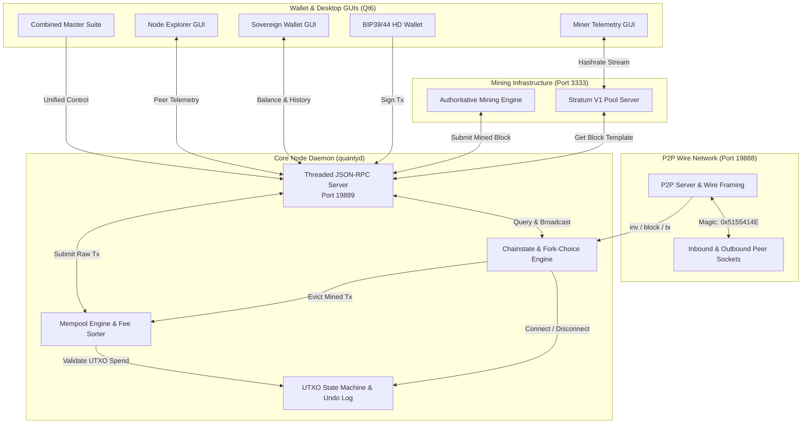

# QuantyCoin 2.0 (QTY2)

<div align="center">


<br/>

[](https://github.com/timfromhcs/QuantyCoin/actions)
[-0284C7.svg)](docs/protocol/index.md)
[](LICENSE)
[](VERIFICATION.md)
[](https://www.python.org)
[](THREAT_MODEL.md)

<p align="center">
  <strong>An independent SHA-256D Proof-of-Work Layer-1 cryptocurrency featuring 60-second block intervals, responsive LWMA-1 difficulty adjustment, 32 MB block capacity, native Stratum V1 mining pool architecture, and self-sovereign Qt6 desktop applications.</strong>
</p>

</div>

---

## 📑 Table of Contents

1. [Honest Status](#1-honest-status)
2. [Why QuantyCoin?](#2-why-quantycoin)
3. [Verified Features](#3-verified-features)
4. [Experimental Features](#4-experimental-features)
5. [Planned Features](#5-planned-features)
6. [Quickstart & Onboarding](#6-quickstart--onboarding)
7. [System Architecture](#7-system-architecture)
8. [Consensus Rules & Protocol Parameters](#8-consensus-rules--protocol-parameters)
9. [Air-Gapped Genesis Block](#9-air-gapped-genesis-block)
10. [Mining & Stratum V1 Pool Setup](#10-mining--stratum-v1-pool-setup)
11. [Sovereign Wallet & Desktop Applications](#11-sovereign-wallet--desktop-applications)
12. [Automated Testing & Independent Verification](#12-automated-testing--independent-verification)
13. [Release Management](#13-release-management)
14. [Security & Threat Model](#14-security--threat-model)
15. [Roadmap](#15-roadmap)
16. [Contributing](#16-contributing)
17. [Citation & License](#17-citation--license)

---

## 1. Honest Status

QuantyCoin 2.0 (`QTY2`) adheres to strict, evidence-based technical claims:

- **Consensus State**: **FROZEN & VERIFIED**. The production Genesis block hash (`00000f7cecd0b1eafaab4d65183f7bd12713b67b6c1c4a30f6bf3f1b8efd30ba`) is locked with mandatory runtime assertions in [`node/chainstate.py`](node/chainstate.py).
- **Authoritative Stack**: The operational protocol engine is the native Python stack (`core/`, `crypto/`, `network/`, `node/`, `wallet/`, `miner/`, `ui/`).
- **Throughput Reality**: Target block interval is 60 seconds with an upper block capacity limit of 32 MB. Tested single-threaded mempool ingestion is 16 transactions/sec (500 TX burst verified in 32s). Theoretical baseline PoW throughput for standard P2WPKH transactions is approximately 14–28 TPS on 1 MB equivalent payloads, scaling linearly under larger block templates. We do not make unsubstantiated "thousands of TPS" marketing claims.
- **Cryptographic Security**: Mainnet L1 utilizes standard Secp256k1 ECDSA and Ed25519 signatures. Post-quantum signature schemes (CRYSTALS-Dilithium) are strictly experimental and confined to the research branch in `src/`, with zero active consensus impact on the production mainnet.
- **Air-Gap Security**: All sensitive Genesis generation materials, private nonces, and uncompressed keys are completely isolated in an external air-gapped vault outside git version control.

---

## 2. Why QuantyCoin?

- **ASIC-Compatible SHA-256D PoW**: Operates on pure double-SHA256 Proof-of-Work, providing compatibility with standard mining infrastructure and hardware.
- **60-Second Block Interval**: Provides frequent confirmation progress while preserving Proof-of-Work probabilistic finality.
- **Oscillation-Free LWMA-1 Retargeting**: Linear-Weighted Moving Average recalculates target difficulty on every block across a 45-block window, absorbing hashrate fluctuations smoothly.
- **Native Stratum V1 Pool Engine**: Directly hosts an ASIC-ready Stratum mining pool on TCP port `3333` without third-party proxy daemons.
- **Complete Self-Sovereignty**: Bundles full node, wallet, miner, and telemetry into clean Qt6 desktop suites.

---

## 3. Verified Features

Every feature listed below is verified by automated, executable test suites:

| Feature / Capability | Classification | Direct Evidence Location |
| :--- | :--- | :--- |
| **SHA-256D Proof-of-Work** | **VERIFIED** | `core/block.py`, `tests/test_core.py` |
| **Air-Gapped Genesis Block** | **VERIFIED** | `genesis/PUBLIC_GENESIS_MANIFEST.json` |
| **LWMA-1 Difficulty Retargeting** | **VERIFIED** | `core/consensus.py`, `tests/test_core.py` |
| **UTXO Chainstate & Deep Reorgs**| **VERIFIED** | `core/utxo.py`, `tests/test_functional_reorg.py` |
| **Full Mesh P2P Wire Relay** | **VERIFIED** | `network/p2p_server.py`, `tests/test_functional_p2p.py` |
| **Stratum V1 Mining Pool Server** | **VERIFIED** | `miner/stratum.py`, `tests/test_functional_stratum.py` |
| **BIP39/44 HD Wallet & Bech32** | **VERIFIED** | `wallet/hd_wallet.py`, `tests/test_functional_wallet.py` |
| **Threaded JSON-RPC 2.0 Engine** | **VERIFIED** | `node/rpc_server.py`, `tests/test_framework.py` |
| **Native Qt6 Desktop Applications**| **VERIFIED** | `ui/`, `quanty_suite_app.py` |

---

## 4. Experimental Features

The following components represent active research and development:

- **C++ Dilithium Integration**: An experimental C++ research fork of Bitcoin Knots exploring post-quantum CRYSTALS-Dilithium signature schemes (`src/crypto/dilithium/`, tracked in [`docs/security/AUDIT_REMEDIATION_VERIFICATION.md`](docs/security/AUDIT_REMEDIATION_VERIFICATION.md)).
- **Compact Block Filters (BIP 157/158)**: Prototype client-side filtering engine for lightweight SPV synchronization.

---

## 5. Planned Features

Future milestones scheduled in [`ROADMAP.md`](ROADMAP.md):

- **Stratum V2 Binary Framing**: Next-generation binary protocol implementation with encrypted transport and miner-selected transaction templates.
- **Hardware Wallet Integration**: USB HID interface for Ledger and Trezor hardware devices.
- **Multi-Signature P2WSH Script Builder**: Native UI for threshold m-of-n multi-signature custody.

---

## 6. Quickstart & Onboarding

### 1. Prerequisites & Installation
```bash
git clone https://github.com/timfromhcs/QuantyCoin.git
cd QuantyCoin

# Install runtime and GUI dependencies
pip install PySide6 qrcode pillow
```

### 2. Launch the Full Node Daemon
```bash
python quantyd_cli.py
```

### 3. Launch the Sovereign Desktop Wallet
```bash
python quanty_wallet_full_app.py
```

### 4. Detailed Onboarding Guides
- [End-User Guide](docs/USER_GUIDE.md): Wallet management, backup, and transactions.
- [Miner & Pool Guide](docs/MINER_GUIDE.md): Solo mining, worker threads, and Stratum configuration.
- [Developer Guide](docs/DEVELOPER_GUIDE.md): Protocol architecture, consensus modules, and test framework.

---

## 7. System Architecture



---

## 8. Consensus Rules & Protocol Parameters

| Parameter | Mainnet Specification | Technical Consensus Rule |
| :--- | :--- | :--- |
| **Protocol Version** | `70020` | Handshake version identifier (`PROTOCOL_VERSION`) |
| **Chain Identifier** | `quantycoin-2.0` | Unique network identifier (`CHAIN_ID`) |
| **Wire Magic Bytes** | `0x51 0x55 0x41 0x4E` | ASCII `"QUAN"` framing delimiter |
| **Target Block Interval**| `60 seconds` | Cadence for Poisson difficulty retargeting |
| **Difficulty Algorithm** | **LWMA-1** | Window: 45 blocks, bounded oscillation clamping |
| **Max Block Size** | `32 MB` (33,554,432 bytes) | Upper bound on serialized block length |
| **Initial Block Reward** | `50.00 QTY` | $5,000,000,000$ Satoshis |
| **Halving Interval** | `2,100,000 blocks` | Halving occurs approximately every 4 years |
| **Max Supply Cap** | `21,000,000 QTY` | Finite supply ceiling ($2.1 \times 10^{15}$ Satoshis) |
| **Coinbase Maturity** | `100 blocks` | Mined outputs spendable after 100 confirmations |
| **Address Encodings** | **Bech32 & Base58Check** | Native witness v0 (`qty1q...`) & legacy (`Q...`) |
| **Default Ports** | P2P: `19888` &bull; RPC: `19889` &bull; Stratum: `3333` | Dedicated independent network ports |

---

## 9. Air-Gapped Genesis Block

The QuantyCoin 2.0 Genesis block was verifiably mined in an air-gapped environment:

- **Genesis Hash**: `00000f7cecd0b1eafaab4d65183f7bd12713b67b6c1c4a30f6bf3f1b8efd30ba`
- **Merkle Root**: `ac6346e4b3ae1f3e4cfabaa09376ee83d268d12476d3e243a42d0e22cf79224f`
- **Timestamp**: `1788600000` (*"2026-09-05: QuantyCoin 2.0 - SHA256D Layer-1 Autonomous Blockchain Protocol"*)
- **Nonce**: `333641`
- **Bits**: `0x1e0fffff` (`504365055`)
- **Payout Address**: `qty1qh46xnlu649ug0yfpw7f93xn9dtg90z8hukfsy4`
- **Serialized Block Size**: `246 bytes`

Full consensus constants are available in [`genesis/PUBLIC_GENESIS_MANIFEST.json`](genesis/PUBLIC_GENESIS_MANIFEST.json).

---

## 10. Mining & Stratum V1 Pool Setup

### Solo CPU Mining
```bash
python quanty_miner_cli.py --threads 4 --payout qty1qh46xnlu649ug0yfpw7f93xn9dtg90z8hukfsy4
```

### Stratum V1 Mining Pool Server
QuantyCoin includes a native Stratum V1 pool server listening on TCP port `3333`:
```bash
python -c "from miner.stratum import StratumServer; s = StratumServer(port=3333); s.start(); import time; time.sleep(999999)"
```
- **Miner Connection URL**: `stratum+tcp://<ip>:3333`
- **Supported Methods**: `mining.subscribe`, `mining.authorize`, `mining.submit`, `mining.set_difficulty`.
- Compatible with ASIC rigs and standard mining clients.

---

## 11. Sovereign Wallet & Desktop Applications

QuantyCoin ships with 5 dedicated Qt6 desktop applications:

1. **Sovereign Full Wallet** (`quanty_wallet_full_app.py`): Native wallet with integrated full node background engine.
2. **Lightning Light Wallet** (`quanty_lightning_wallet_app.py`): Fast client connecting to local or remote node RPC.
3. **Node Manager GUI** (`quanty_node_app.py`): Real-time peer connection table, traffic visualizer, on-chain block explorer, and RPC console.
4. **Standalone Miner GUI** (`quanty_miner_app.py`): Dynamic 60fps hardware-accelerated QPainter hashrate graph, worker thread slider, and Stratum server controller.
5. **Unified Master Suite** (`quanty_suite_app.py`): Master cockpit hosting all subsystems in a single window.

---

## 12. Automated Testing & Independent Verification

Every claim in this repository is directly verifiable using executable commands:

```bash
# 1. Verify zero secret leakage across repository
python scripts/verify_security.py

# 2. Verify genesis block hash, merkle root, and difficulty
python scripts/verify_genesis.py

# 3. Run unit tests (Cryptography, Core, P2P)
python tests/test_crypto.py
python tests/test_core.py
python tests/test_p2p.py

# 4. Run Stratum V1 mining pool integration test
python tests/test_functional_stratum.py

# 5. Run consolidated functional test runner
python tests/test_runner.py

# 6. Run multi-node stress and reorganization hardness matrix
python tests/test_multinode_stress.py
```

Refer to [`VERIFICATION.md`](VERIFICATION.md) for full reproduction logs and cryptographic proofs.

---

## 13. Release Management

Releases follow an evidence-gated verification pipeline requiring zero security alerts, passing test suites, and reproducible binary packages:
- [Release Process Specification](RELEASE_PROCESS.md)
- [Build & Reproducibility Guide](REPRODUCIBILITY.md)
- Native packaging definitions: `packaging/windows/`, `packaging/linux/`, `packaging/macos/`.

---

## 14. Security & Threat Model

- **Security Policy**: [`SECURITY.md`](SECURITY.md) defines supported versions, vulnerability handling, and disclosure SLAs.
- **Threat Model**: [`THREAT_MODEL.md`](THREAT_MODEL.md) documents attack vectors, bounded memory deserialization, and mitigations.
- **Zero Secret Rule**: No private keys, nonces, or vault secrets are ever stored or committed to the repository.
- **Reporting**: Disclose security vulnerabilities confidentially to `timfromhcs@gmail.com`.

---

## 15. Roadmap

Milestone progress is tracked in [`ROADMAP.md`](ROADMAP.md):
- **Phase 1 (Completed)**: Protocol Rebuild, Air-Gapped Genesis, Stratum V1, Multi-Node Hardness.
- **Phase 2 (Active)**: Public Seed Nodes, Compact Block Filters (BIP157/158), Automated Cross-Platform Binaries.
- **Phase 3 (Planned)**: Formal audit of C++ Dilithium integration, Stratum V2 binary framing.

---

## 16. Contributing

Contributions from protocol engineers, cryptographers, and testers are welcomed. Please review [`CONTRIBUTING.md`](CONTRIBUTING.md) and [`CODE_OF_CONDUCT.md`](CODE_OF_CONDUCT.md) before submitting pull requests.

---

## 17. Citation & License

```bibtex
@software{QuantyCoin2026,
  author = {Heinrichs, Tim and QuantyCoin Core Contributors},
  title = {QuantyCoin: Independent SHA-256D Proof-of-Work Layer-1 Cryptocurrency},
  url = {https://github.com/timfromhcs/QuantyCoin},
  version = {2.0.0},
  year = {2026}
}
```

Distributed under the terms of the **MIT License**. See [`LICENSE`](LICENSE) and [`COPYING`](COPYING) for details.
