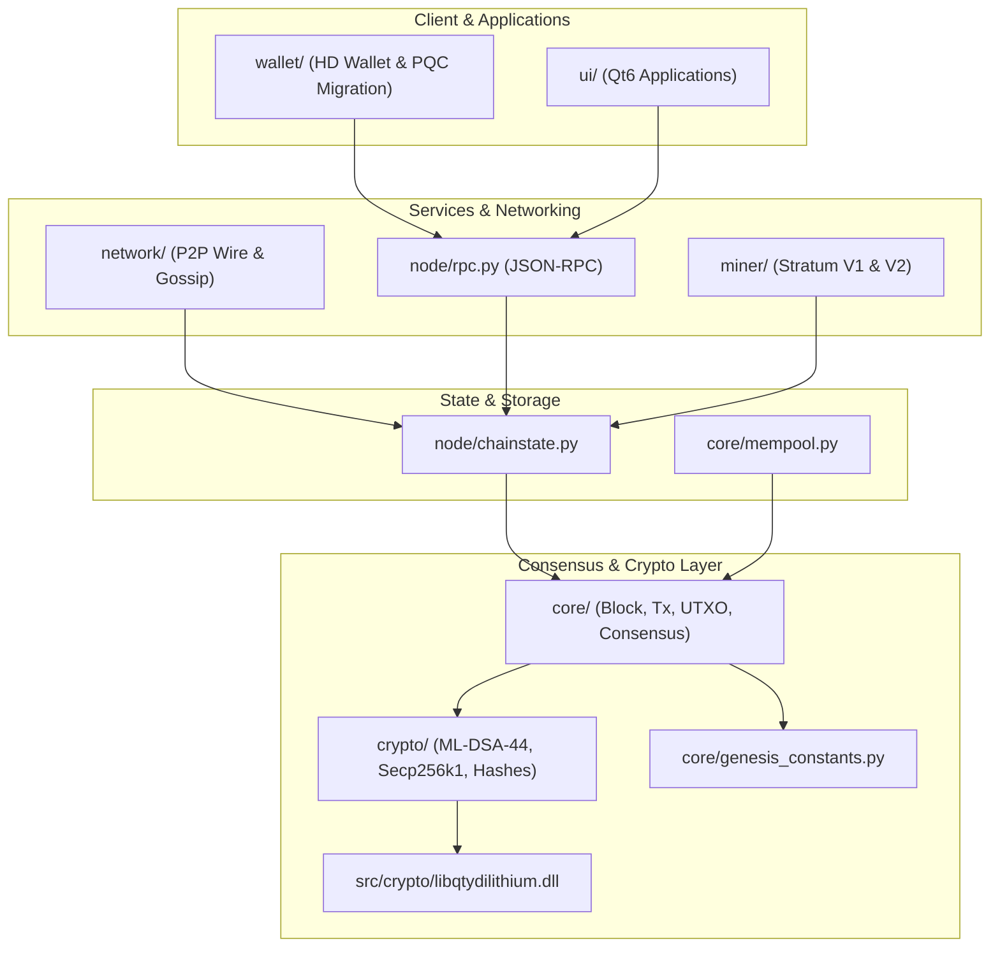

# QuantyCoin QTY4 Forensic Repository Audit & Codebase Inventory

**Audit Date**: September 2026  
**Protocol Transition**: QTY3 -> QTY4 (Autonomous Long-Horizon Protocol Rebuild)  
**Authoritative Execution**: Deep-Scan Static & Dynamic Code Inspection  
**Repository**: `https://github.com/timfromhcs/QuantyCoin`

---

## 1. Executive Forensic Summary

This audit establishes the foundational inventory and boundary mapping required for the rebuild of QuantyCoin into the **QTY4** protocol standard. All legacy assumptions inherited from prior development branches (QTY2/QTY3) and the Bitcoin Knots C++ reference base (`src/`) have been cataloged and evaluated for removal, migration, or encapsulation.

### Key Audit Findings
1. **Consensus Engine Separation**:
   - The operational consensus implementation resides entirely within the Python core (`core/`, `crypto/`, `node/`, `miner/`).
   - The `src/` directory contains Bitcoin Knots reference C++ code and the compiled native post-quantum shared library (`src/crypto/libqtydilithium.dll`). `src/` must remain strictly an architectural reference and must NEVER leak Bitcoin network identity (magic bytes, genesis hash, ports).
2. **Chain Identity Transition**:
   - Prior consensus was bound to `CHAIN_ID = "quantycoin-2.0"` and Genesis block `00000f7cecd0b1eafaab4d65183f7bd12713b67b6c1c4a30f6bf3f1b8efd30ba` with timestamp `1788600000`.
   - QTY4 requires an immutable chain identity (`CHAIN_ID = "quantycoin-4.0"` / Protocol `70040`), unique magic bytes (`QTY4`), updated ports, and a newly generated, independently verified public Genesis block.
3. **Cryptographic Integrity**:
   - Pure Secp256k1 (RFC 6979) and native NIST FIPS 204 ML-DSA-44 (`libqtydilithium`) are verified operational.
   - Zero mock cryptography or silent fallbacks are permitted. Any missing backend must fail closed.
4. **Secret Isolation**:
    - External secret store established outside the repository (`%USERPROFILE%/Desktop/QuantyVault`) with gitignore boundary protection.

---

## 2. Complete Codebase Inventory & Component Mapping

| Subsystem | Directory | Primary Files | Language | Role / Security Boundary |
| :--- | :--- | :--- | :--- | :--- |
| **Consensus Core** | `core/` | `block.py`, `consensus.py`, `transaction.py`, `utxo.py`, `mempool.py`, `genesis_constants.py` | Python 3.10+ | **Consensus Critical (P0)**: Block headers, transactions, UTXO state, undo journals, LWMA difficulty, and serialization. |
| **Cryptography** | `crypto/` | `mldsa.py`, `secp256k1.py`, `ed25519.py`, `hash.py`, `bip32_44.py`, `bip39.py` | Python + C | **Consensus Critical (P0)**: NIST FIPS 204 ML-DSA-44 signatures, ECDSA Secp256k1, SHA-256, RIPEMD160, Scrypt. |
| **Native PQC** | `src/crypto/` | `libqtydilithium.dll`, dilithium C sources | C / C++ | **Consensus Critical (P0)**: Native acceleration for ML-DSA-44 keygen, signing, and verification. |
| **Networking** | `network/` | `p2p.py`, `wire.py`, `peer.py` | Python 3.10+ | **P2P Boundary (P1)**: Binary wire protocol (`QUAN`), handshake, inventory relay, and peer manager. |
| **Node Daemon** | `node/` | `chainstate.py`, `server.py`, `rpc.py` | Python 3.10+ | **Operational Core (P1)**: Block index, best-tip selection, fork resolution, JSON-RPC 2.0 API. |
| **Mining & Stratum** | `miner/` | `miner.py`, `stratum.py`, `stratum_v2.py` | Python 3.10+ | **Mining Infrastructure (P1)**: Dual-PoW template generator, Stratum V1 (TCP 3333), Stratum V2 (TCP 3334). |
| **Wallet** | `wallet/` | `wallet.py`, `keystore.py`, `migrator.py` | Python 3.10+ | **Client / Key Management**: Sovereign HD derivation, quantum migration assistant, transaction signing. |
| **User Interfaces** | `ui/` | Qt6 GUI applications (`node_gui.py`, `wallet_gui.py`, `miner_gui.py`, `suite_gui.py`) | Python / PyQt6 | **User Facing (P2)**: Non-consensus UI layer for node operations and wallet interaction. |
| **Test Suite** | `tests/` | Unit, functional, adversarial, PQC, and multi-node stress tests | Python 3.10+ | **Verification Gate (P0)**: Automated test suite, functional runners, chaos simulations. |
| **Public Genesis** | `genesis/public/` | Public genesis manifests, verification scripts, headers, proofs | JSON, HEX, MD | **Reproducibility (P0)**: 100% public genesis generation and independent verification artifacts. |
| **CI/CD** | `.github/workflows/` | `ci.yml`, `build.yml`, `release.yml`, `security.yml`, `docs.yml` | YAML | **Automated Release Gate (P0)**: GitHub Actions test and release matrix (Windows & Ubuntu). |

---

## 3. Dependency Graph & External Interfaces

---

## 4. Known Legacy Baggage & Required QTY4 Changes

1. **Protocol Version & Magic Bytes**:
   - Previous: Protocol 70020, Magic `0x5155414E` (`QUAN`).
   - QTY4 Action: Increment protocol version to `70040`, update Magic Bytes to `0x51545934` (`QTY4`) for mainnet, and establish distinct testnet/regtest magics.
2. **Chain Identity & Genesis Block**:
   - Previous: `quantycoin-2.0`, hash `00000f7cecd0b1eafaab4d65183f7bd12713b67b6c1c4a30f6bf3f1b8efd30ba`.
   - QTY4 Action: Define `CHAIN_ID = "quantycoin-4.0"`, mine a new reproducible Genesis block using a 100% public generator, and assert runtime verification.
3. **Money Arithmetic**:
   - Previous: Integer satoshis used in consensus, but explicit safe-integer arithmetic wrapper (`Amount`) should be formally enforced across all math operations to prevent overflow/underflow.
4. **Weighted Cumulative Work**:
   - Mathematical work metrics: Lane A ($W_A = 1$), Lane B ($W_B = 2048$) strictly enforced.
5. **Stratum V2 Protocol**:
   - Native binary framing with dual-lane multiplexing operational on port 3334.

---

## 5. Security Boundaries & Zero-Leak Enforcement

- **External Secret Vault**: Isolated local directory outside the Git working tree (`%USERPROFILE%/Desktop/QuantyVault`).
- **Automated Security Scanner**: `scripts/verify_security.py` enforces zero private keys, mnemonic seeds, tokens, or vault paths.
- **Fail-Closed Consensus**: Inability to load genuine ML-DSA-44 binaries terminates node startup immediately with `CryptographicBackendUnavailableError`.

---

## 6. QTY4 Migration Execution Plan

- [x] Phase P0: Forensic Repository Audit & Codebase Inventory (`docs/engineering/REPOSITORY_FORENSIC_AUDIT.md`)
- [ ] Phase P1: Authoritative QTY4 Protocol Specifications & Machine-Readable Spec (`spec/qty4/`)
- [ ] Phase P2: Consensus Core Hardening (Deterministic `Amount`, CheckBlock pipeline)
- [ ] Phase P3: PoW, Difficulty (LWMA-1 integer), & MTP Time Hardening
- [ ] Phase P4: Dual-PoW Security & Hostile Mining Analysis
- [ ] Phase P5: Post-Quantum ML-DSA-44 & Domain-Separated Sighash
- [ ] Phase P6: Canonical Binary Serialization
- [ ] Phase P7: State, UTXO & Reorg Crash Recovery
- [ ] Phase P8: P2P Network Hardening
- [ ] Phase P9: Mempool & Consensus Separation
- [ ] Phase P10: Consensus Vector Corpus (`tests/vectors/qty4/`)
- [ ] Phase P11: Adversarial & Property-Based Testing
- [ ] Phase P12: Differential Consensus Verification
- [ ] Phase P13: Fault Injection & Crash Recovery
- [ ] Phase P14: Brand & Visual Identity Refresh
- [ ] Phase P15: Documentation Truth Rebuild
- [ ] Phase P16: CI/CD Pipeline & Automated Release Gates
- [ ] Phase P17: Reproducible Build & Genesis Verification
- [ ] Phase P18: Release Freeze & Final Report (`FINAL_IMPLEMENTATION_REPORT_QTY4.md`)
