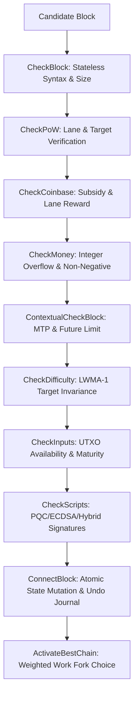

# QuantyCoin QTY4 Consensus Rules Specification

**Protocol**: QTY4 (70040)  
**Chain ID**: `quantycoin-4.0`  

---

## 1. Validation Pipeline

Every candidate block received via P2P gossip or RPC submission must traverse the sequential validation pipeline:

---

## 2. Invariant Validation Checks

### CheckBlock (Stateless)
- Block size must not exceed `33,554,432 bytes` (32 MB).
- Block must contain at least 1 transaction.
- Transaction[0] must be a valid coinbase transaction.
- Transactions[1..N] must NOT be coinbase transactions.
- Merkle root in header must match root computed from transaction IDs (`txid`).
- Proof-of-Work hash must satisfy the target specified in `bits`.

### ContextualCheckBlock (Chain-Dependent)
- Protocol version must match active chain standard (`70040`).
- Header timestamp must be strictly greater than the Median-Time-Past (MTP) of the previous 11 blocks.
- Header timestamp must not exceed `current_network_time + 7200 seconds` (2-hour future limit).
- Difficulty target `bits` must equal the exact LWMA-1 calculation for the block's PoW lane.

### CheckInputs & CheckScripts
- Referenced previous outputs must exist in the UTXO set.
- No duplicate inputs within a transaction.
- Output value sum must not exceed input value sum (difference is transaction fee).
- Coinbase outputs must satisfy maturity (`COINBASE_MATURITY = 100 blocks`) before being spent.
- Signatures must verify under the designated authorization mode (Secp256k1, ML-DSA-44, or Hybrid).
- Pseudo-cryptography, mock verifiers, or malleated signatures result in permanent block rejection.
